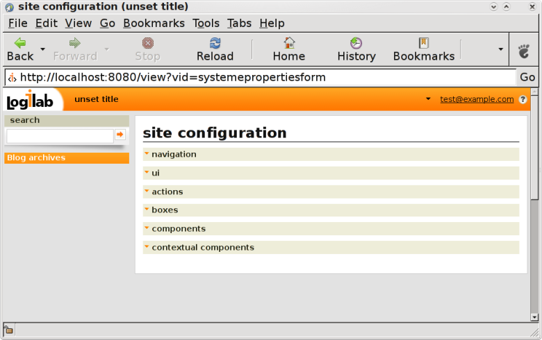

.. -*- coding: utf-8 -*-

User interface for web site configuration
=========================================

This panel allows you to configure the appearance of your instance site.
Six menus are available and we will go through each of them to explain how
to use them.

Navigation
~~~~~~~~~~
This menu provides you a way to adjust some navigation options depending on
your needs, such as the number of entities to display by page of results.
Follows the detailled list of available options :

* navigation.combobox-limit : maximum number of entities to display in related
  combo box (sample format: 23)
* navigation.page-size : maximum number of objects displayed by page of results
  (sample format: 23)
* navigation.related-limit : maximum number of related entities to display in
  the primary view (sample format: 23)
* navigation.short-line-size : maximum number of characters in short description
  (sample format: 23)

UI
~~
This menu provides you a way to customize the user interface settings such as
date format or encoding in the produced html.
Follows the detailled list of available options :

* ui.date-format : how to format date in the ui ("man strftime" for format description)
* ui.datetime-format : how to format date and time in the ui ("man strftime" for format
  description)
* ui.default-text-format : default text format for rich text fields.
* ui.encoding : user interface encoding
* ui.fckeditor :should html fields being edited using fckeditor (a HTML WYSIWYG editor).
  You should also select text/html as default text format to actually get fckeditor.
* ui.float-format : how to format float numbers in the ui
* ui.language : language of the user interface
* ui.main-template : id of main template used to render pages
* ui.site-title	: site title, which is displayed right next to the logo in the header
* ui.time-format : how to format time in the ui ("man strftime" for format description)

Actions
~~~~~~~
This menu provides a way to configure the context in which you expect the actions
to be displayed to the user and if you want the action to be visible or not.
You must have notice that when you view a list of entities, an action box is
available on the left column which display some actions as well as a drop-down
menu for more actions.

The context available are :

* mainactions : actions listed in the left box
* moreactions : actions listed in the `more` menu of the left box
* addrelated : add actions listed in the left box
* useractions : actions listed in the first section of drop-down menu
  accessible from the right corner user login link
* siteactions : actions listed in the second section of drop-down menu
  accessible from the right corner user login link
* hidden : select this to hide the specific action

Boxes
~~~~~
The instance has already a pre-defined set of boxes you can use right away.
This configuration section allows you to place those boxes where you want in the
instance interface to customize it.

The available boxes are :

* actions box : box listing the applicable actions on the displayed data

* boxes_blog_archives_box : box listing the blog archives

* possible views box : box listing the possible views for the displayed data

* rss box : RSS icon to get displayed data as a RSS thread

* search box : search box

* startup views box : box listing the configuration options available for
  the instance site, such as `Preferences` and `Site Configuration`

Components
~~~~~~~~~~
[WRITE ME]

Contextual components
~~~~~~~~~~~~~~~~~~~~~
[WRITE ME]

