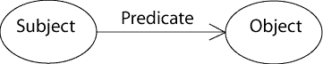

.. _rql_intro:

Introduction
------------

Goals of RQL
~~~~~~~~~~~~

The goal is to have a semantic language in order to:

- query relations in a clear syntax
- empowers access to data repository manipulation
- making attributes/relations browsing easy

As such, attributes will be regarded as cases of special relations (in
terms of usage, the user should see no syntactic difference between an
attribute and a relation).

Comparison with existing languages
~~~~~~~~~~~~~~~~~~~~~~~~~~~~~~~~~~

SQL
```

RQL may remind of SQL but works at a higher abstraction level (the *CubicWeb*
framework generates SQL from RQL to fetch data from relation databases). RQL is
focused on browsing relations. The user needs only to know about the *CubicWeb*
data model he is querying, but not about the underlying SQL model.

Sparql
``````

The query language most similar to RQL is SPARQL_, defined by the W3C to serve
for the semantic web.

Versa
`````

We should look in more detail, but here are already some ideas for the moment
... Versa_ is the language most similar to what we wanted to do, but the model
underlying data being RDF, there are some things such as namespaces or
handling of the RDF types which does not interest us. On the functionality
level, Versa_ is very comprehensive including through many functions of
conversion and basic types manipulation, which we may want to look at one time
or another.  Finally, the syntax is a little esoteric.

Datalog
```````

Datalog_ is a prolog derived query langage which applies to relational
databases. It is more expressive than RQL in that it accepts either
extensional_ and intensional_ predicates (or relations). As of now,
RQL only deals with intensional relations.

The different types of queries
~~~~~~~~~~~~~~~~~~~~~~~~~~~~~~

Search (`Any`)
   Extract entities and attributes of entities.

Insert entities (`INSERT`)
   Insert new entities or relations in the database.
   It can also directly create relationships for the newly created entities.

Update entities, create relations (`SET`)
   Update existing entities in the database,
   or create relations between existing entities.

Delete entities or relationship (`DELETE`)
   Remove entities or relations existing in the database.


RQL relation expressions
~~~~~~~~~~~~~~~~~~~~~~~~

RQL expressions apply to a live database defined by a
:ref:`datamodel_definition`. Apart from the main type, or head, of the
expression (search, insert, etc.) the most common constituent of an
RQL expression is a (set of) relation expression(s).

An RQL relation expression contains three components:

* the subject, which is an entity type
* the predicate, which is a relation definition (an arc of the schema)
* the object, which is either an attribute or a relation to another entity



.. warning::

 A relation is always expressed in the order: ``subject``,
 ``predicate``, ``object``.

 It is important to determine if the entity type is subject or object
 to construct a valid expression. Inverting the subject/object is an
 error since the relation cannot be found in the schema.

 If one does not have access to the code, one can find the order by
 looking at the schema image in manager views (the subject is located
 at the beginning of the arrow).

An example of two related relation expressions::

  P works_for C, P name N

RQL variables represent typed entities. The type of entities is
either automatically inferred (by looking at the possible relation
definitions, see :ref:`RelationDefinition`) or explicitely constrained
using the ``is`` meta relation.

In the example above, we barely need to look at the schema. If
variable names (in the RQL expression) and relation type names (in the
schema) are expresssively designed, the human reader can infer as much
as the |cubicweb| querier.

The ``P`` variable is used twice but it always represent the same set
of entities. Hence ``P works_for C`` and ``P name N`` must be
compatible in the sense that all the Ps (which *can* refer to
different entity types) must accept the ``works_for`` and ``name``
relation types. This does restrict the set of possible values of P.

Adding another relation expression::

  P works_for C, P name N, C name "logilab"

This further restricts the possible values of P through an indirect
constraint on the possible values of ``C``. The RQL-level unification_
happening there is translated to one (or several) joins_ at the
database level.

.. note::

 In |cubicweb|, the term `relation` is often found without ambiguity
 instead of `predicate`.  This predicate is also known as the
 `property` of the triple in `RDF concepts`_


RQL Operators
~~~~~~~~~~~~~

An RQL expression's head can be completed using various operators such
as ``ORDERBY``, ``GROUPBY``, ``HAVING``, ``LIMIT`` etc.

RQL relation expressions can be grouped with ``UNION`` or
``WITH``. Predicate oriented keywords such as ``EXISTS``, ``OR``,
``NOT`` are available.

The complete zoo of RQL operators is described extensively in the
following chapter (:ref:`RQL`).

.. _RDF concepts: http://www.w3.org/TR/rdf-concepts/
.. _Versa: http://wiki.xml3k.org/Versa
.. _SPARQL: http://www.w3.org/TR/rdf-sparql-query/
.. _unification: http://en.wikipedia.org/wiki/Unification_(computing)
.. _joins: http://en.wikipedia.org/wiki/Join_(SQL)
.. _Datalog: http://en.wikipedia.org/wiki/Datalog
.. _intensional: http://en.wikipedia.org/wiki/Intensional_definition
.. _extensional: http://en.wikipedia.org/wiki/Extension_(predicate_logic)

