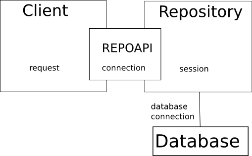

.. -*- coding: utf-8 -*-

Tests
=====

Unit tests
----------

The *CubicWeb* framework provides the
:class:`cubicweb.devtools.testlib.CubicWebTC` test base class .

Tests shall be put into the mycube/test directory. Additional test
data shall go into mycube/test/data.

It is much advised to write tests concerning entities methods,
actions, hooks and operations, security. The
:class:`~cubicweb.devtools.testlib.CubicWebTC` base class has
convenience methods to help test all of this.

In the realm of views, automatic tests check that views are valid
XHTML. See :ref:`automatic_views_tests` for details.

Most unit tests need a live database to work against. This is achieved
by CubicWeb using automatically sqlite (bundled with Python, see
http://docs.python.org/library/sqlite3.html) as a backend.

The database is stored in the mycube/test/tmpdb,
mycube/test/tmpdb-template files. If it does not (yet) exist, it will
be built automatically when the test suite starts.

.. warning::

  Whenever the schema changes (new entities, attributes, relations)
  one must delete these two files. Changes concerned only with entity
  or relation type properties (constraints, cardinalities,
  permissions) and generally dealt with using the
  `sync_schema_props_perms()` function of the migration environment do
  not need a database regeneration step.

.. _hook_test:

Unit test by example
````````````````````

We start with an example extracted from the keyword cube (available
from http://www.cubicweb.org/project/cubicweb-keyword).

.. sourcecode:: python

    from cubicweb.devtools.testlib import CubicWebTC
    from cubicweb import ValidationError

    class ClassificationHooksTC(CubicWebTC):

        def setup_database(self):
            with self.admin_access.repo_cnx() as cnx:
                group_etype = cnx.find('CWEType', name='CWGroup').one()
                c1 = cnx.create_entity('Classification', name=u'classif1',
                                       classifies=group_etype)
                user_etype = cnx.find('CWEType', name='CWUser').one()
                c2 = cnx.create_entity('Classification', name=u'classif2',
                                       classifies=user_etype)
                self.kw1eid = cnx.create_entity('Keyword', name=u'kwgroup', included_in=c1).eid
                cnx.commit()

        def test_cannot_create_cycles(self):
            with self.admin_access.repo_cnx() as cnx:
                kw1 = cnx.entity_from_eid(self.kw1eid)
                # direct obvious cycle
                with self.assertRaises(ValidationError):
                    kw1.cw_set(subkeyword_of=kw1)
                cnx.rollback()
                # testing indirect cycles
                kw3 = cnx.execute('INSERT Keyword SK: SK name "kwgroup2", SK included_in C, '
                                  'SK subkeyword_of K WHERE C name "classif1", K eid %(k)s'
                                  {'k': kw1}).get_entity(0,0)
                kw3.cw_set(reverse_subkeyword_of=kw1)
                self.assertRaises(ValidationError, cnx.commit)

The test class defines a :meth:`setup_database` method which populates the
database with initial data. Each test of the class runs with this
pre-populated database.

The test case itself checks that an Operation does its job of
preventing cycles amongst Keyword entities.

The `create_entity` method of connection (or request) objects allows
to create an entity. You can link this entity to other entities, by
specifying as argument, the relation name, and the entity to link, as
value. In the above example, the `Classification` entity is linked to
a `CWEtype` via the relation `classifies`. Conversely, if you are
creating a `CWEtype` entity, you can link it to a `Classification`
entity, by adding `reverse_classifies` as argument.

.. note::

   the :meth:`commit` method is not called automatically. You have to
   call it explicitly if needed (notably to test operations). It is a
   good practice to regenerate entities with :meth:`entity_from_eid`
   after a commit to avoid request cache effects.

You can see an example of security tests in the
:ref:`adv_tuto_security`.

It is possible to have these tests run continuously using `apycot`_.

.. _apycot: http://www.cubicweb.org/project/apycot

.. _securitytest:

Managing connections or users
+++++++++++++++++++++++++++++

Since unit tests are done with the SQLITE backend and this does not
support multiple connections at a time, you must be careful when
simulating security, changing users.

By default, tests run with a user with admin privileges. Connections
using these credentials are accessible through the `admin_access` object
of the test classes.

The `repo_cnx()` method returns a connection object that can be used as a
context manager:

.. sourcecode:: python

   # admin_access is a pre-cooked session wrapping object
   # it is built with:
   # self.admin_access = self.new_access('admin')
   with self.admin_access.repo_cnx() as cnx:
       cnx.execute(...)
       self.create_user(cnx, login='user1')
       cnx.commit()

   user1access = self.new_access('user1')
   with user1access.web_request() as req:
       req.execute(...)
       req.cnx.commit()

On exit of the context manager, a rollback is issued, which releases
the connection. Don't forget to issue the `cnx.commit()` calls!

.. warning::

   Do not use references kept to the entities created with a
   connection from another one!

Email notifications tests
`````````````````````````

When running tests, potentially generated e-mails are not really sent
but are found in the list `MAILBOX` of module
:mod:`cubicweb.devtools.testlib`.

You can test your notifications by analyzing the contents of this list, which
contains objects with two attributes:

* `recipients`, the list of recipients
* `msg`, email.Message object

Let us look at a simple example from the ``blog`` cube.

.. sourcecode:: python

    from cubicweb.devtools.testlib import CubicWebTC, MAILBOX

    class BlogTestsCubicWebTC(CubicWebTC):
        """test blog specific behaviours"""

        def test_notifications(self):
            with self.admin_access.web_request() as req:
                cubicweb_blog = req.create_entity('Blog', title=u'cubicweb',
                                    description=u'cubicweb is beautiful')
                blog_entry_1 = req.create_entity('BlogEntry', title=u'hop',
                                                 content=u'cubicweb hop')
                blog_entry_1.cw_set(entry_of=cubicweb_blog)
                blog_entry_2 = req.create_entity('BlogEntry', title=u'yes',
                                                 content=u'cubicweb yes')
                blog_entry_2.cw_set(entry_of=cubicweb_blog)
                self.assertEqual(len(MAILBOX), 0)
                req.cnx.commit()
                self.assertEqual(len(MAILBOX), 2)
                mail = MAILBOX[0]
                self.assertEqual(mail.subject, '[data] hop')
                mail = MAILBOX[1]
                self.assertEqual(mail.subject, '[data] yes')

Visible actions tests
`````````````````````

It is easy to write unit tests to test actions which are visible to
a user or to a category of users. Let's take an example in the
`conference cube`_.

.. _`conference cube`: http://www.cubicweb.org/project/cubicweb-conference
.. sourcecode:: python

    class ConferenceActionsTC(CubicWebTC):

        def setup_database(self):
            with self.admin_access.repo_cnx() as cnx:
                self.confeid = cnx.create_entity('Conference',
                                                 title=u'my conf',
                                                 url_id=u'conf',
                                                 start_on=date(2010, 1, 27),
                                                 end_on = date(2010, 1, 29),
                                                 call_open=True,
                                                 reverse_is_chair_at=chair,
                                                 reverse_is_reviewer_at=reviewer).eid

        def test_admin(self):
            with self.admin_access.web_request() as req:
                rset = req.find('Conference').one()
                self.assertListEqual(self.pactions(req, rset),
                                      [('workflow', workflow.WorkflowActions),
                                       ('edit', confactions.ModifyAction),
                                       ('managepermission', actions.ManagePermissionsAction),
                                       ('addrelated', actions.AddRelatedActions),
                                       ('delete', actions.DeleteAction),
                                       ('generate_badge_action', badges.GenerateBadgeAction),
                                       ('addtalkinconf', confactions.AddTalkInConferenceAction)
                                       ])
                self.assertListEqual(self.action_submenu(req, rset, 'addrelated'),
                                      [(u'add Track in_conf Conference object',
                                        u'http://testing.fr/cubicweb/add/Track'
                                        u'?__linkto=in_conf%%3A%(conf)s%%3Asubject&'
                                        u'__redirectpath=conference%%2Fconf&'
                                        u'__redirectvid=' % {'conf': self.confeid}),
                                       ])

You just have to execute a rql query corresponding to the view you want to test,
and to compare the result of
:meth:`~cubicweb.devtools.testlib.CubicWebTC.pactions` with the list of actions
that must be visible in the interface. This is a list of tuples. The first
element is the action's `__regid__`, the second the action's class.

To test actions in a submenu, you just have to test the result of
:meth:`~cubicweb.devtools.testlib.CubicWebTC.action_submenu` method. The last
parameter of the method is the action's category. The result is a list of
tuples. The first element is the action's title, and the second element the
action's url.


.. _automatic_views_tests:

Automatic views testing
-----------------------

This is done automatically with the :class:`cubicweb.devtools.testlib.AutomaticWebTest`
class. At cube creation time, the mycube/test/test_mycube.py file
contains such a test. The code here has to be uncommented to be
usable, without further modification.

The ``auto_populate`` method uses a smart algorithm to create
pseudo-random data in the database, thus enabling the views to be
invoked and tested.

Depending on the schema, hooks and operations constraints, it is not
always possible for the automatic auto_populate to proceed.

It is possible of course to completely redefine auto_populate. A
lighter solution is to give hints (fill some class attributes) about
what entities and relations have to be skipped by the auto_populate
mechanism. These are:

* `no_auto_populate`, may contain a list of entity types to skip
* `ignored_relations`, may contain a list of relation types to skip
* `application_rql`, may contain a list of rql expressions that
  auto_populate cannot guess by itself; these must yield resultsets
  against which views may be selected.

.. warning::

  Take care to not let the imported `AutomaticWebTest` in your test module
  namespace, else both your subclass *and* this parent class will be run.

Cache heavy database setup
-------------------------------

Some test suites require a complex setup of the database that takes
seconds (or even minutes) to complete. Doing the whole setup for each
individual test makes the whole run very slow. The ``CubicWebTC``
class offer a simple way to prepare a specific database once for
multiple tests. The `test_db_id` class attribute of your
``CubicWebTC`` subclass must be set to a unique identifier and the
:meth:`pre_setup_database` class method must build the cached content. As
the :meth:`pre_setup_database` method is not garanteed to be called
every time a test method is run, you must not set any class attribute
to be used during test *there*. Databases for each `test_db_id` are
automatically created if not already in cache. Clearing the cache is
up to the user. Cache files are found in the :file:`data/database`
subdirectory of your test directory.

.. warning::

  Take care to always have the same :meth:`pre_setup_database`
  function for all classes with a given `test_db_id` otherwise your
  tests will have unpredictable results depending on the first
  encountered one.


Testing on a real-life database
-------------------------------

The ``CubicWebTC`` class uses the `cubicweb.devtools.ApptestConfiguration`
configuration class to setup its testing environment (database driver,
user password, application home, and so on). The `cubicweb.devtools`
module also provides a `RealDatabaseConfiguration`
class that will read a regular cubicweb sources file to fetch all
this information but will also prevent the database to be initalized
and reset between tests.

For a test class to use a specific configuration, you have to set
the `_config` class attribute on the class as in:

.. sourcecode:: python

    from cubicweb.devtools import RealDatabaseConfiguration
    from cubicweb.devtools.testlib import CubicWebTC

    class BlogRealDatabaseTC(CubicWebTC):
        _config = RealDatabaseConfiguration('blog',
                                            sourcefile='/path/to/realdb_sources')

        def test_blog_rss(self):
            with self.admin_access.web_request() as req:
                rset = req.execute('Any B ORDERBY D DESC WHERE B is BlogEntry, '
                                   'B created_by U, U login "logilab", B creation_date D')
                self.view('rss', rset, req=req)


Testing with other cubes
------------------------

Sometimes a small component cannot be tested all by itself, so one
needs to specify other cubes to be used as part of the the unit test
suite. This is handled by the ``bootstrap_cubes`` file located under
``mycube/test/data``. One example from the `preview` cube::

 card, file, preview

The format is:

* possibly several empy lines or lines starting with ``#`` (comment lines)
* one line containing a comma-separated list of cube names.

It is also possible to add a ``schema.py`` file in
``mycube/test/data``, which will be used by the testing framework,
therefore making new entity types and relations available to the
tests. 

Literate programming
--------------------

CubicWeb provides some literate programming capabilities. The :ref:`cubicweb-ctl`
`shell` command accepts different file formats. If your file ends with `.txt`
or `.rst`, the file will be parsed by :mod:`doctest.testfile` with CubicWeb's
:ref:`migration` API enabled in it.

Create a `scenario.txt` file in the `test/` directory and fill with some content.
Refer to the :mod:`doctest.testfile` `documentation`_.

.. _documentation: http://docs.python.org/library/doctest.html

Then, you can run it directly by::

    $ cubicweb-ctl shell <cube_instance> test/scenario.txt

When your scenario file is ready, put it in a new test case to be able to run
it automatically.

.. sourcecode:: python

      from os.path import dirname, join
      from logilab.common.testlib import unittest_main
      from cubicweb.devtools.testlib import CubicWebTC

      class AcceptanceTC(CubicWebTC):

              def test_scenario(self):
                      self.assertDocTestFile(join(dirname(__file__), 'scenario.txt'))

      if __name__ == '__main__':
              unittest_main()

Skipping a scenario
```````````````````

If you want to set up initial conditions that you can't put in your unit test
case, you have to use a :exc:`KeyboardInterrupt` exception only because of the
way :mod:`doctest` module will catch all the exceptions internally.

    >>> if condition_not_met:
    ...     raise KeyboardInterrupt('please, check your fixture.')

Passing paramaters
``````````````````
Using extra arguments to parametrize your scenario is possible by prepending them
by double dashes.

Please refer to the `cubicweb-ctl shell --help` usage.

.. important::
    Your scenario file must be utf-8 encoded.

Test APIS
---------

Using Pytest
````````````

The `pytest` utility (shipping with `logilab-common`_, which is a
mandatory dependency of CubicWeb) extends the Python unittest
functionality and is the preferred way to run the CubicWeb test
suites. Bare unittests also work the usual way.

.. _logilab-common: http://www.logilab.org/project/logilab-common

To use it, you may:

* just launch `pytest` in your cube to execute all tests (it will
  discover them automatically)
* launch `pytest unittest_foo.py` to execute one test file
* launch `pytest unittest_foo.py bar` to execute all test methods and
  all test cases whose name contains `bar`

Additionally, the `-x` option tells pytest to exit at the first error
or failure. The `-i` option tells pytest to drop into pdb whenever an
exception occurs in a test.

When the `-x` option has been used and the run stopped on a test, it
is possible, after having fixed the test, to relaunch pytest with the
`-R` option to tell it to start testing again from where it previously
failed.

Using the `TestCase` base class
```````````````````````````````

The base class of CubicWebTC is logilab.common.testlib.TestCase, which
provides a lot of convenient assertion methods.

.. autoclass:: logilab.common.testlib.TestCase
   :members:

CubicWebTC API
``````````````
.. autoclass:: cubicweb.devtools.testlib.CubicWebTC
   :members:


What you need to know about request and session
-----------------------------------------------



First, remember to think that some code run on a client side, some
other on the repository side. More precisely:

* client side: web interface, raw repoapi connection (cubicweb-ctl shell for
  instance);

* repository side: RQL query execution, that may trigger hooks and operation.

The client interacts with the repository through a repoapi connection.


.. note::

   These distinctions are going to disappear in cubicweb 3.21 (if not
   before).

A repoapi connection is tied to a session in the repository. The connection and
request objects are inaccessible from repository code / the session object is
inaccessible from client code (theoretically at least).

The web interface provides a request class.  That `request` object provides
access to all cubicweb resources, eg:

* the registry (which itself provides access to the schema and the
  configuration);

* an underlying repoapi connection (when using req.execute, you actually call the
  repoapi);

* other specific resources depending on the client type (url generation according
  to base url, form parameters, etc.).


A `session` provides an api similar to a request regarding RQL execution and
access to global resources (registry and all), but also has the following
responsibilities:

* handle transaction data, that will live during the time of a single
  transaction. This includes the database connections that will be used to
  execute RQL queries.

* handle persistent data that may be used across different (web) requests

* security and hooks control (not possible through a request)


The `_cw` attribute
```````````````````
The `_cw` attribute available on every application object provides access to all
cubicweb resources, i.e.:

- For code running on the client side (eg web interface view), `_cw` is a request
  instance.

- For code running on the repository side (hooks and operation), `_cw` is a
  Connection or Session instance.


Beware some views may be called with a session (e.g. notifications) or with a
request.


Request, session and transaction
````````````````````````````````

In the web interface, an HTTP request is handled by a single request, which will
be thrown away once the response is sent.

The web publisher handles the transaction:

* commit / rollback is done automatically

* you should not commit / rollback explicitly, except if you really
  need it

Let's detail the process:

1. an incoming RQL query comes from a client to the web stack

2. the web stack opens an authenticated database connection for the
   request, which is associated to a user session

3. the query is executed (through the repository connection)

4. this query may trigger hooks. Hooks and operations may execute some rql queries
   through `cnx.execute`.

5. the repository gets the result of the query in 1. If it was a RQL read query,
   the database connection is released. If it was a write query, the connection
   is then tied to the session until the transaction is commited or rolled back.

6. results are sent back to the client

This implies several things:

* when using a request, or code executed in hooks, this database
  connection handling is totally transparent

* however, take care when writing tests: you are usually faking /
  testing both the server and the client side, so you have to decide
  when to use RepoAccess.client_cnx or RepoAccess.repo_cnx. Ask
  yourself "where will the code I want to test be running, client or
  repository side?". The response is usually: use a repo (since the
  "client connection" concept is going away in a couple of releases).
