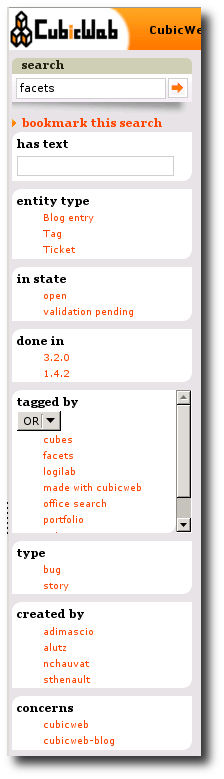

The facets system
-----------------

Facets allow to restrict searches according to some user friendly criterias.
CubicWeb has a builtin `facet`_ system to define restrictions `filters`_ really
as easily as possible.

Here is an exemple of the facets rendering picked from our
http://www.cubicweb.org web site:

Facets will appear on each page presenting more than one entity that may be
filtered according to some known criteria.

Base classes for facets
~~~~~~~~~~~~~~~~~~~~~~~
.. automodule:: cubicweb.web.facet

.. _facet: http://en.wikipedia.org/wiki/Faceted_browser
.. _filters: http://www.cubicweb.org/blogentry/154152

