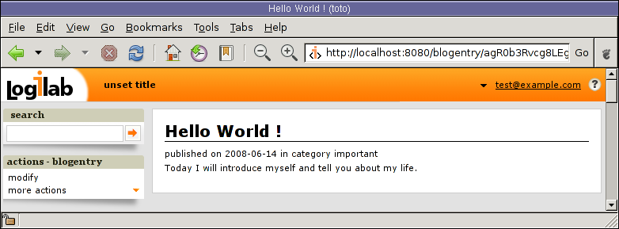

.. _primary_view:

The Primary View
-----------------

By default, *CubicWeb* provides a view that fits every available
entity type. This is the first view you might be interested in
modifying. It is also one of the richest and most complex.

It is automatically selected on a one line result set containing an
entity.

It lives in the :mod:`cubicweb.web.views.primary` module.

The *primary* view is supposed to render a maximum of informations about the
entity.

.. _primary_view_layout:

Layout
``````

The primary view has the following layout.

.. image:: ../../../images/primaryview_template.png

.. _primary_view_configuration:

Primary view configuration
``````````````````````````

If you want to customize the primary view of an entity, overriding the primary
view class may not be necessary. For simple adjustments (attributes or relations
display locations and styles), a much simpler way is to use uicfg.

Attributes/relations display location
^^^^^^^^^^^^^^^^^^^^^^^^^^^^^^^^^^^^^

In the primary view, there are three sections where attributes and
relations can be displayed (represented in pink in the image above):

* 'attributes'
* 'relations'
* 'sideboxes'

**Attributes** can only be displayed in the attributes section (default
  behavior). They can also be hidden. By default, attributes of type `Password`
  and `Bytes` are hidden.

For instance, to hide the ``title`` attribute of the ``Blog`` entity:

.. sourcecode:: python

   from cubicweb.web.views import uicfg
   uicfg.primaryview_section.tag_attribute(('Blog', 'title'), 'hidden')

**Relations** can be either displayed in one of the three sections or hidden.

For relations, there are two methods:

* ``tag_object_of`` for modifying the primary view of the object
* ``tag_subject_of`` for modifying the primary view of the subject

These two methods take two arguments:

* a triplet ``(subject, relation_name, object)``, where subject or object can be replaced with ``'*'``
* the section name or ``hidden``

.. sourcecode:: python

   pv_section = uicfg.primaryview_section
   # hide every relation `entry_of` in the `Blog` primary view
   pv_section.tag_object_of(('*', 'entry_of', 'Blog'), 'hidden')

   # display `entry_of` relations in the `relations`
   # section in the `BlogEntry` primary view
   pv_section.tag_subject_of(('BlogEntry', 'entry_of', '*'), 'relations')


Display content
^^^^^^^^^^^^^^^

You can use ``primaryview_display_ctrl`` to customize the display of attributes
or relations. Values of ``primaryview_display_ctrl`` are dictionaries.


Common keys for attributes and relations are:

* ``vid``: specifies the regid of the view for displaying the attribute or the relation.

  If ``vid`` is not specified, the default value depends on the section:
    * ``attributes`` section: 'reledit' view
    * ``relations`` section: 'autolimited' view
    * ``sideboxes`` section: 'sidebox' view

* ``order``: int used to control order within a section. When not specified,
  automatically set according to order in which tags are added.

* ``label``: label for the relations section or side box

* ``showlabel``: boolean telling whether the label is displayed

.. sourcecode:: python

   # let us remind the schema of a blog entry
   class BlogEntry(EntityType):
       title = String(required=True, fulltextindexed=True, maxsize=256)
       publish_date = Date(default='TODAY')
       content = String(required=True, fulltextindexed=True)
       entry_of = SubjectRelation('Blog', cardinality='?*')

   # now, we want to show attributes
   # with an order different from that in the schema definition
   view_ctrl = uicfg.primaryview_display_ctrl
   for index, attr in enumerate('title', 'content', 'publish_date'):
       view_ctrl.tag_attribute(('BlogEntry', attr), {'order': index})

By default, relations displayed in the 'relations' section are being displayed by
the 'autolimited' view. This view will use comma separated values, or list view
and/or limit your rset if there is too much items in it (and generate the "view
all" link in this case).

You can control this view by setting the following values in the
`primaryview_display_ctrl` relation tag:

* `limit`, maximum number of entities to display. The value of the
  'navigation.related-limit'  cwproperty is used by default (which is 8 by default).
  If None, no limit.

* `use_list_limit`, number of entities until which they should be display as a list
  (eg using the 'list' view). Below that limit, the 'csv' view is used. If None,
  display using 'csv' anyway.

* `subvid`, the subview identifier (eg view that should be used of each item in the
  list)

Notice you can also use the `filter` key to set up a callback taking the related
result set as argument and returning it filtered, to do some arbitrary filtering
that can't be done using rql for instance.


.. sourcecode:: python

   pv_section = uicfg.primaryview_section
   # in `CWUser` primary view, display `created_by`
   # relations in relations section
   pv_section.tag_object_of(('*', 'created_by', 'CWUser'), 'relations')

   # display this relation as a list, sets the label,
   # limit the number of results and filters on comments
   def filter_comment(rset):
       return rset.filtered_rset(lambda x: x.e_schema == 'Comment')
   pv_ctrl = uicfg.primaryview_display_ctrl
   pv_ctrl.tag_object_of(('*', 'created_by', 'CWUser'),
                         {'vid': 'list', 'label': _('latest comment(s):'),
                          'limit': True,
                          'filter': filter_comment})

.. warning:: with the ``primaryview_display_ctrl`` rtag, the subject or the
   object of the relation is ignored for respectively ``tag_object_of`` or
   ``tag_subject_of``. To avoid warnings during execution, they should be set to
   ``'*'``.


.. automodule:: cubicweb.web.views.primary


Example of customization and creation
`````````````````````````````````````

We'll show you now an example of a ``primary`` view and how to customize it.

If you want to change the way a ``BlogEntry`` is displayed, just
override the method ``cell_call()`` of the view ``primary`` in
``BlogDemo/views.py``.

.. sourcecode:: python

   from cubicweb.predicates import is_instance
   from cubicweb.web.views.primary import Primaryview

   class BlogEntryPrimaryView(PrimaryView):
       __select__ = PrimaryView.__select__ & is_instance('BlogEntry')

       def render_entity_attributes(self, entity):
           self.w(u'<p>published on %s</p>' %
                  entity.publish_date.strftime('%Y-%m-%d'))
           super(BlogEntryPrimaryView, self).render_entity_attributes(entity)


The above source code defines a new primary view for
``BlogEntry``. The `__reid__` class attribute is not repeated there since it
is inherited through the `primary.PrimaryView` class.

The selector for this view chains the selector of the inherited class
with its own specific criterion.

The view method ``self.w()`` is used to output data. Here `lines
08-09` output HTML for the publication date of the entry.



Let us now improve the primary view of a blog

.. sourcecode:: python

 from logilab.mtconverter import xml_escape
 from cubicweb.predicates import is_instance, one_line_rset
 from cubicweb.web.views.primary import Primaryview

 class BlogPrimaryView(PrimaryView):
     __regid__ = 'primary'
     __select__ = PrimaryView.__select__ & is_instance('Blog')
     rql = 'Any BE ORDERBY D DESC WHERE BE entry_of B, BE publish_date D, B eid %(b)s'

     def render_entity_relations(self, entity):
         rset = self._cw.execute(self.rql, {'b' : entity.eid})
         for entry in rset.entities():
             self.w(u'<p>%s</p>' % entry.view('inblogcontext'))

 class BlogEntryInBlogView(EntityView):
     __regid__ = 'inblogcontext'
     __select__ = is_instance('BlogEntry')

     def cell_call(self, row, col):
         entity = self.cw_rset.get_entity(row, col)
         self.w(u'<a href="%s" title="%s">%s</a>' %
                entity.absolute_url(),
                xml_escape(entity.content[:50]),
                xml_escape(entity.description))

This happens in two places. First we override the
render_entity_relations method of a Blog's primary view. Here we want
to display our blog entries in a custom way.

At `line 10`, a simple request is made to build a result set with all
the entities linked to the current ``Blog`` entity by the relationship
``entry_of``. The part of the framework handling the request knows
about the schema and infers that such entities have to be of the
``BlogEntry`` kind and retrieves them (in the prescribed publish_date
order).

The request returns a selection of data called a result set. Result
set objects have an .entities() method returning a generator on
requested entities (going transparently through the `ORM` layer).

At `line 13` the view 'inblogcontext' is applied to each blog entry to
output HTML. (Note that the 'inblogcontext' view is not defined
whatsoever in *CubicWeb*. You are absolutely free to define whole view
families.) We juste arrange to wrap each blogentry output in a 'p'
html element.

Next, we define the 'inblogcontext' view. This is NOT a primary view,
with its well-defined sections (title, metadata, attribtues,
relations/boxes). All a basic view has to define is cell_call.

Since views are applied to result sets which can be tables of data, we
have to recover the entity from its (row,col)-coordinates (`line
20`). Then we can spit some HTML.

.. warning::

  Be careful: all strings manipulated in *CubicWeb* are actually
  unicode strings. While web browsers are usually tolerant to
  incoherent encodings they are being served, we should not abuse
  it. Hence we have to properly escape our data. The xml_escape()
  function has to be used to safely fill (X)HTML elements from Python
  unicode strings.

Assuming we added entries to the blog titled `MyLife`, displaying it
now allows to read its description and all its entries.

.. image:: ../../../images/lax-book_10-blog-with-two-entries_en.png
   :alt: a blog and all its entries

