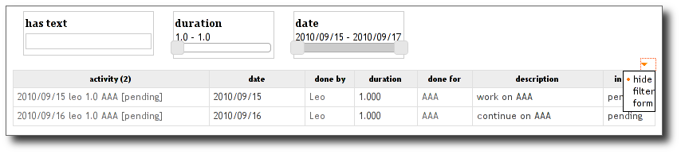

Table views
-----------

.. automodule:: cubicweb.web.views.tableview

Example
```````

Let us take an example from the timesheet cube:

.. sourcecode:: python

    class ActivityResourcesTable(EntityView):
        __regid__ = 'activity.resources.table'
        __select__ = is_instance('Activity')

        def call(self, showresource=True):
            eids = ','.join(str(row[0]) for row in self.cw_rset)
            rql = ('Any R,D,DUR,WO,DESCR,S,A, SN,RT,WT ORDERBY D DESC '
                   'WHERE '
                   '   A is Activity, A done_by R, R title RT, '
                   '   A diem D, A duration DUR, '
                   '   A done_for WO, WO title WT, '
                   '   A description DESCR, A in_state S, S name SN, '
                   '   A eid IN (%s)' % eids)
            rset = self._cw.execute(rql)
            self.wview('resource.table', rset, 'null')

    class ResourcesTable(RsetTableView):
        __regid__ = 'resource.table'
        # notice you may wish a stricter selector to check rql's shape
        __select__ = is_instance('Resource')
        # my table headers
        headers  = ['Resource', 'diem', 'duration', 'workpackage', 'description', 'state']
        # I want a table where attributes are editable (reledit inside)
        finalvid = 'editable-final'

        cellvids = {3: 'editable-final'}
        # display facets and actions with a menu
        layout_args = {'display_filter': 'top',
                       'add_view_actions': None}

To obtain an editable table, you may specify the 'editable-table' view identifier
using some of `cellvids`, `finalvid` or `nonfinalvid`.

The previous example results in:

.. image:: ../../../images/views-table-shadow.png

In order to activate table filter mechanism, the `display_filter` option is given
as a layout argument. A small arrow will be displayed at the table's top right
corner. Clicking on `show filter form` action, will display the filter form as
below:



By the same way, you can display additional actions for the selected entities
by setting `add_view_actions` layout option to `True`. This will add actions
returned by the view's :meth:`~cubicweb.web.views.tableview.TableMixIn.table_actions`.

You can notice that all columns of the result set are not displayed. This is
because of given `headers`, implying to display only columns from 0 to
len(headers).

Also Notice that the `ResourcesTable` view relies on a particular rql shape
(which is not ensured by the way, the only checked thing is that the result set
contains instance of the `Resource` type). That usually implies that you can't
use this view for user specific queries (e.g. generated by facets or typed
manually).


So another option would be to write this view using
:class:`~cubicweb.web.views.tableview.EntityTableView`, as below.

.. sourcecode:: python

    class ResourcesTable(EntityTableView):
        __regid__ = 'resource.table'
        __select__ = is_instance('Resource')
        # table columns definition
        columns  = ['resource', 'diem', 'duration', 'workpackage', 'description', 'in_state']
        # I want a table where attributes are editable (reledit inside)
        finalvid = 'editable-final'
        # display facets and actions with a menu
        layout_args = {'display_filter': 'top',
                       'add_view_actions': None}

        def workpackage_cell(entity):
            activity = entity.reverse_done_in[0]
            activity.view('reledit', rtype='done_for', role='subject', w=w)
        def workpackage_sortvalue(entity):
            activity = entity.reverse_done_in[0]
            return activity.done_for[0].sortvalue()

        column_renderers = {
            'resource': MainEntityColRenderer(),
            'workpackage': EntityTableColRenderer(
               header='Workpackage',
               renderfunc=workpackage_cell,
               sortfunc=workpackage_sortvalue,),
            'in_state': EntityTableColRenderer(
               renderfunc=lambda w,x: w(x.cw_adapt_to('IWorkflowable').printable_state),
               sortfunc=lambda x: x.cw_adapt_to('IWorkflowable').printable_state),
         }

Notice the following point:

* `cell_<column>(w, entity)` will be searched for rendering the content of a
  cell. If not found, `column` is expected to be an attribute of `entity`.

* `cell_sortvalue_<column>(entity)` should return a typed value to use for
  javascript sorting or None for not sortable columns (the default).

* The :func:`etable_entity_sortvalue` decorator will set a 'sortvalue' function
  for the column containing the main entity (the one given as argument to all
  methods), which will call `entity.sortvalue()`.

* You can set a column header using the :func:`etable_header_title` decorator.
  This header will be translated. If it's not an already existing msgid, think
  to mark it using `_()` (the example supposes headers are schema defined msgid).


Pro/cons of each approach
`````````````````````````
:class:`EntityTableView` and :class:`RsetableView` provides basically the same
set of features, though they don't share the same properties. Let's try to sum
up pro and cons of each class.

* `EntityTableView` view is:

  - more verbose, but usually easier to understand

  - easily extended (easy to add/remove columns for instance)

  - doesn't rely on a particular rset shape. Simply give it a title and will be
    listed in the 'possible views' box if any.

* `RsetTableView` view is:

  - hard to beat to display barely a result set, or for cases where some of
    `headers`, `displaycols` or `cellvids` could be defined to enhance the table
    while you don't care about e.g. pagination or facets.

  - hardly extensible, as you usually have to change places where the view is
    called to modify the RQL (hence the view's result set shape).
