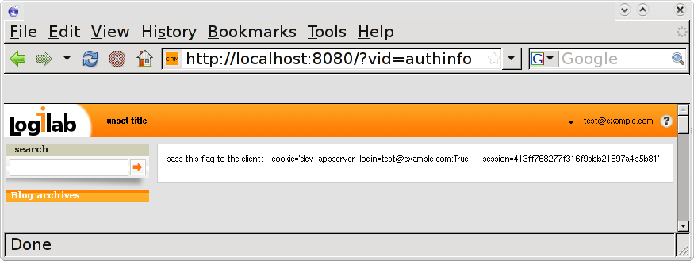

.. -*- coding: utf-8 -*-

CubicWeb in Google AppEngine
============================

What is  `Google AppEngine` ?
------------------------------

`Google AppEngine`_ is provided with a partial port of the `Django`
framework, but Google stated at Google IO 2008 that it would not
support a specific Python web framework and that all
community-supported frameworks would be more than welcome [1]_. 

Therefore `Logilab`_ ported `CubicWeb` to run on top of `Google AppEngine`'s
datastore.

.. _`Google AppEngine`: http://code.google.com/appengine/docs/whatisgoogleappengine.html
.. _Logilab: http://www.logilab.fr/
.. [1] for more on this matter, read our blog at http://www.logilab.org/blogentry/5216

Download the source
-------------------

- The `Google AppEngine SDK` can be downloaded from:
  http://code.google.com/appengine/downloads.html

Please follow instructions on how to install `CubicWeb` framework
(:ref:`CubicWebInstallation`). 

Installation
------------

Once ``cubicweb-ctl`` is installed, then you can create a Google
App Engine extension of our framework by running the command ::

   cubicweb-ctl newgapp <myapp>

This will create a directory containing ::
 
   `-- myapp/
       |-- app.conf
       |-- app.yaml
       |-- bin/
       |    `-- laxctl
       |-- boostrap_cubes
       |-- cubes/
       |    |-- addressbook/
       |    ..
       |    |-- comment
       |    ..
       |    `-- zone/
       |-- cubicweb/
       |-- custom.py
       |-- cw-cubes/
       |-- dateutil/
       |-- docutils/
       |-- fckeditor/
       |-- i18n/
       |-- index.yaml
       |-- loader.py
       |-- logilab/
       |-- main.py
       |-- migration.py
       |-- mx/
       |-- roman.py
       |-- rql/
       |-- schema.py
       |-- simplejson/
       |-- tools/
       |-- views.py
       |-- vobject/
       |-- yams/
       `-- yapps/

  
This skeleton directory is a working `AppEngine` application. You will
recognize the files ``app.yaml`` and ``main.py``. All the rest is the
`CubicWeb` framework and its third-party libraries. You will notice that 
the directory ``cubes`` is a library of reusable cubes.

The main directories that you should know about are:

  - ``cubes`` : this is a library of reusable yams cubes. To use 
    those cubes you will list them in the variable 
    `included-yams-cubes` of ``app.conf``. See also :ref:`cubes`. 
  - [WHICH OTHER ONES SHOULD BE LISTED HERE?]

Dependencies
~~~~~~~~~~~~

Before starting anything, please make sure the following packages are installed:
  - yaml : by default google appengine is providing yaml; make sure you can
    import it. We recommend you create a symbolic link yaml instead of installing 
    and using python-yaml:
    yaml -> full/path/to/google_appengine/lib/yaml/lib/yaml/
  - gettext

Setup
~~~~~

Once you executed ``cubicweb-ctl newgapp <myapp>``, you can use that ``myapp/`` 
as an application directory and do as follows.

This installation directory provides a configuration for an instance of `CubicWeb`
ported for Google App Engine. It is installed with its own command ``laxctl`` 
which is a port of the command tool ``cubicweb-ctl`` originally developped for 
`CubicWeb`.

You can have the details of available commands by running ::

   $ python myapp/bin/laxctl --help

Generating translation files
~~~~~~~~~~~~~~~~~~~~~~~~~~~~~

`CubicWeb` is fully internationalized. Translation catalogs are found in
``myapp/i18n``. To compile the translation files, use the `gettext` tools
or the ``laxctl`` command ::

  $ python myapp/bin/laxctl i18ncube 
  $ python myapp/bin/laxctl i18ninstance

Ignore the errors that print "No translation file found for domain
'cubicweb'". They disappear after the first run of i18ninstance.

.. note:: The command  myapp/bin/laxctl i18ncube needs to be executed
   only if your application is using cubes from cubicweb-apps.
   Otherwise, please skip it.

You will never need to add new entries in the translation catalog. Instead we would
recommand you to use ``self.req._("msgId")`` in your application code
to flag new message id to add to the catalog, where ``_`` refers to
xgettext that is used to collect new strings to translate. 
While running ``laxctl i18ncube``, new string will be added to the catalogs.

Generating the data directory
~~~~~~~~~~~~~~~~~~~~~~~~~~~~~

In order to generate the ``myapp/data`` directory that holds the static
files like stylesheets and icons, you need to run the command::

  $ python myapp/bin/laxctl populatedata

Generating the schema diagram
~~~~~~~~~~~~~~~~~~~~~~~~~~~~~

There is a view named ``schema`` that displays a diagram of the
entity-relationship graph defined by the schema. This diagram has to
be generated from the command line::

  $ python myapp/bin/laxctl genschema

Application configuration
-------------------------

Authentication
~~~~~~~~~~~~~~

You have the option of using or not google authentication for your application.
This has to be define in ``app.conf`` and ``app.yaml``.

In ``app.conf`` modify the following variable::
 
  # does this application rely on google authentication service or not.
  use-google-auth=no
 
In ``app.yaml`` comment the `login: required` set by default in the handler::

  - url: .*
  script: main.py
  # comment the line below to allow anonymous access or if you don't want to use
  # google authentication service
  #login: required

Quickstart : launch the application
-----------------------------------

On Mac OS X platforms, drag that directory on the
`GoogleAppEngineLauncher`.

On Unix and Windows platforms, run it with the dev_appserver::

  $ python /path/to/google_appengine/dev_appserver.py /path/to/myapp/

Once the local server is started, visit `http://MYAPP_URL/_load <http://localhost:8080/_load>`_ and sign in as administrator. 
This will initialize the repository and enable you to log in into 
the application and continue the installation.

You should be redirected to a page displaying a message `content initialized`.

Initialize the datastore
~~~~~~~~~~~~~~~~~~~~~~~~

You, then, want to visit  `http://MYAPP_URL/?vid=authinfo <http://localhost:8080/?vid=authinfo>`_ .
If you selected not  to use google authentication, you will be prompted to a 
login form where you should initialize the administrator login (recommended
to use admin/admin at first). You will then be redirected to a page providing
you the value to provide to ``./bin/laxctl --cookie``.

If you choosed to use google authentication, then you will not need to set up
and administrator login but you will get the cookie value as well.

This cookie values needs to be provided to ``laxctl`` commands
in order to handle datastore administration requests.

.. note:: In case you are not redirected to a page providing the 
   option --cookie value, please visit one more time  
   `http://MYAPP_URL/?vid=authinfo <http://localhost:8080/?vid=authinfo>`_ .

Once, you have this value, then return to the shell and execute ::
 
  $ python myapp/bin/laxctl db-init --cookie='dev_appserver_login=test@example.com:True; __session=7bbe973a6705bc5773a640f8cf4326cc' localhost:8080

.. note:: In the case you are not using google authentication, the value returned
   by `http://MYAPP_URL/?vid=authinfo <http://localhost:8080/?vid=authinfo>`_ 
   will look like :
   --cookie='__session=2b45d1a9c36c03d2a30cedb04bc37b6d'

Log out by clicking in the menu at the top right corner
and restart browsing from `http://MYAPP_URL/ <http://localhost:8080>`_ 
as a normal user.

Unless you did something to change it, http://MYAPP_URL should be
http://localhost:8080/
