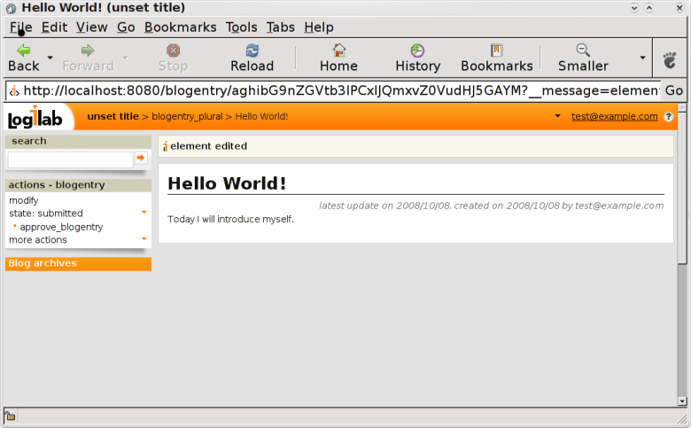

.. -*- coding: utf-8 -*-

Define a Workflow
=================

General
-------

A workflow describes how certain entities have to evolve between
different states. Hence we have a set of states, and a "transition graph",
i.e. a list of possible transitions from one state to another state.

We will define a simple workflow for a blog, with only the following
two states: `submitted` and `published`. So first, we create a simple
*CubicWeb* in ten minutes (see :ref:`BlogFiveMinutes`).

Set-up a workflow
-----------------

We want to create a workflow to control the quality of the BlogEntry
submitted on your instance. When a BlogEntry is created by a user
its state should be `submitted`. To be visible to all, it has to
be in the state `published`. To move it from `submitted` to `published`,
we need a transition that we can call `approve_blogentry`.

A BlogEntry state should not be modifiable by every user.
So we have to define a group of users, `moderators`, and
this group will have appropriate permissions to publish a BlogEntry.

There are two ways to create a workflow: from the user interface,
or by defining it in ``migration/postcreate.py``.
This script is executed each time a new ``cubicweb-ctl db-init`` is done.
We strongly recommend to create the workflow in ``migration/postcreate.py``
and we will now show you how. Read `Under the hood`_ to understand why.

The state of a entity is managed by the `in_state` attribute which can be added to you entity schema by two ways:

* direct inheritance by subclassing your class from `cubicweb.schema.WorkflowableEntityType`
* by delegation using `cubicweb.schema.make_worflowable` (usable as a decorator)

About our example of BlogEntry, we must have:

.. sourcecode:: python

  from cubicweb.schema import WorkflowableEntityType

  class BlogEntry(EntityType, WorkflowableEntityType):
      ...

Create states, transitions and group permissions
~~~~~~~~~~~~~~~~~~~~~~~~~~~~~~~~~~~~~~~~~~~~~~~~

The ``postcreate.py`` script is executed in a special environment, adding
several *CubicWeb* primitives that can be used.
They are all defined in the ``class ServerMigrationHelper``.
We will only discuss the methods we use to create a workflow in this example.

To define our workflow for BlogDemo, please add the following lines
to ``migration/postcreate.py``:

.. sourcecode:: python

  _ = unicode

  moderators = add_entity('CWGroup', name=u"moderators")

This adds the `moderators` user group.

.. sourcecode:: python

  wf = add_workflow(u'your workflow description', 'BlogEntry')

At first, instanciate a new workflow object with a gentle description and the concerned entity types (this one can be a tuple for multiple value).

.. sourcecode:: python

  submitted = wf.add_state(_('submitted'), initial=True)
  published = wf.add_state(_('published'))

``add_state`` expects as first argument the name of the state you want to create and an optional argument to say if it is supposed to be the initial state of the entity type.

.. sourcecode:: python

  wf.add_transition(_('approve_blogentry'), (submitted,), published, ('moderators', 'managers'),)

``add_transition`` expects

  * as the first argument the name of the transition
  * then the list of states on which the transition can be triggered,
  * the target state of the transition,
  * and the permissions
    (e.g. a list of user groups who can apply the transition; the user
    has to belong to at least one of the listed group to perform the action).

.. sourcecode:: python

  checkpoint()

.. note::
  Do not forget to add the `_()` in front of all states and transitions names while creating
  a workflow so that they will be identified by the i18n catalog scripts.

In addition to the user group conditions which the user needs to belong to one of those, we could have added a RQL condition.
In this case, the user can only perform the action if the two conditions are satisfied.

If we use a RQL condition on a transition, we can use the following variables:

* `%(eid)s`, object's eid
* `%(ueid)s`, user executing the query eid
* `%(seid)s`, the object's current state eid

You can notice that in the action box of a BlogEntry, the state
is now listed as well as the possible transitions for the current state defined by the workflow.
The transitions will only be displayed for users having the right permissions.
In our example, the transition `approve_blogentry` will only be displayed
for the users belonging to the group `moderators` or `managers`.

Under the hood
~~~~~~~~~~~~~~

A workflow is a collection of entities of type ``State`` and of type ``Transition``
which are standard *CubicWeb* entity types.

For instance, the preceding lines:

.. sourcecode:: python

  submitted = wf.add_state(_('submitted'), initial=True)
  published = wf.add_state(_('published'))

will create two entities of type ``State``, one with name 'submitted', and the other
with name 'published'. Whereas:

.. sourcecode:: python

  wf.add_transition(_('approve_blogentry'), (submitted,), published, ('moderators', 'managers'),)

will create an entity of type ``Transition`` with name `approve_blogentry` which will
be linked to the ``State`` entities created before.
As a consequence, we could use the administration interface to do these operations. But it is not recommended because it will be uselessly complicated and will be only local to your instance.

Indeed, if you create the states and transitions through the user interface, next time you initialize the database you will have to re-create all the entities.
The user interface should only be a reference for you to view the states and transitions, but is not the appropriate interface to define your application workflow.

