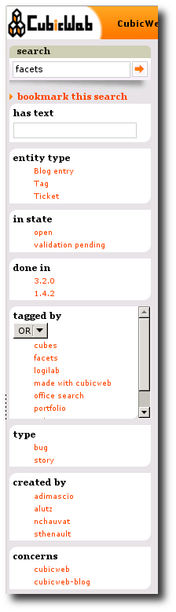
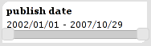

The facets system
-----------------

Facets allow to restrict searches according to some criteria. CubicWeb has a builtin `facet`_ system to define restrictions
`filters`_ really as easily as possible. A few base classes for facets
are provided in ``cubicweb.web.facet.py``. All classes inherits from
the base class ``AbstractFacet``. 

Here is an overview of the facets rendering pick from the `tracker` cube:

Facets will appear on each page presenting more than one entity.

VocabularyFacet
~~~~~~~~~~~~~~~~
The ``VocabularyFacet`` inherits from the ``AbstractFacet``.
A class which inherits from VocabularyFacets must redefine these methods:

.. automethod:: cubicweb.web.facet.VocabularyFacet.vocabulary
.. automethod:: cubicweb.web.facet.VocabularyFacet.possible_values

RelationFacet
~~~~~~~~~~~~~~

The ``RelationFacet`` inherits from the ``VocabularyFacet``. It allows to filter entities according to certain relation's values. Generally, you just have to define some class attributes like:

- rtype: the name of the relation
- role: the default value is set to `subject`
- target_attr: needed if it is not the default attribute of the entity

To illustrate this facet, let's take for example an *excerpt* of the schema of an office location search application:

.. sourcecode:: python

  class Office(WorkflowableEntityType):
      price = Int(description='euros / m2 / HC / HT')
      surface = Int(description='m2')
      description = RichString(fulltextindexed=True)
      has_address = SubjectRelation('PostalAddress',
                                    cardinality='1?',
                                    composite='subject')
      proposed_by = SubjectRelation('Agency')
      comments = ObjectRelation('Comment',
                                cardinality='1*',
                                composite='object')
      screenshots = SubjectRelation(('File', 'Image'),
                                    cardinality='*1',
                                    composite='subject')

We define a facet to filter offices according to the attribute
`postalcode` of their associated `PostalAdress`.

.. sourcecode:: python

  class PostalCodeFacet(RelationFacet):
      __regid__ = 'postalcode-facet'      # every registered class must have an id
      __select__ = implements('Office')   # this facet should only be selected when
                                          # visualizing offices
      rtype = 'has_address'               # this facet is a filter on the entity linked to
                                          # the office thrhough the relation
                                          # has_address
      target_attr = 'postalcode'          # the filter's key is the attribute "postal_code"
                                          # of the target PostalAddress entity

AttributeFacet
~~~~~~~~~~~~~~

The ``AttributeFacet`` inherits from the ``RelationFacet``. It allows to filter entities according to certain attribute's values.

The example below resumes the former schema. We define now a filter based on the `surface` attribute of the
`Office`.

.. sourcecode:: python

  class SurfaceFacet(AttributeFacet):
      __regid__ = 'surface-facet'       # every registered class must have an id
      __select__ = implements('Office') # this facet should only be selected when
                                        # visualizing offices
      rtype = 'surface'                 # the filter's key is the attribute "surface"
      comparator = '>='                 # override the default value of operator since
                                        # we want to filter according to a
                                        # minimal
                                        # value, not an exact one

      def rset_vocabulary(self, ___):
          """override the default vocabulary method since we want to hard-code
          our threshold values.
          Not overriding would generate a filter box with all existing surfaces
          defined in the database.
          """
          return [('> 200', '200'), ('> 250', '250'),
                  ('> 275', '275'), ('> 300', '300')]

RangeFacet
~~~~~~~~~~
The ``RangeFacet`` inherits from the ``AttributeFacet``. It allows to filter entities according to certain attributes of numerical type.

The ``RangeFacet`` displays a slider using `jquery`_ to choose a lower bound and an upper bound.

The example below defines a facet to filter a selection of books according to their number of pages.

.. sourcecode:: python

   class BookPagesFacet(RangeFacet):
       __regid__ = 'priority-facet'
       __select__ = RangeFacet.__select__ & implements('Book')
       rtype = 'pages'

The image below display the rendering of the ``RangeFacet``:

DateRangeFacet
~~~~~~~~~~~~~~
The ``DateRangeFacet`` inherits from the ``RangeFacet``. It allows to filter entities according to certain attributes of date type.

Here is an example of code that defines a facet to filter
musical works according to their composition date:

.. sourcecode:: python

    class CompositionDateFacet(DateRangeFacet):
        # 1. make sure this facet is displayed only on Track selection
        __select__ = DateRangeFacet.__select__ & implements('Track')
        # 2. give the facet an id required by CubicWeb)
        __regid__ = 'compdate-facet'
        # 3. specify the attribute name that actually stores the date in the DB
        rtype = 'composition_date'

With this facet, on each page displaying tracks, you'll be able to filter them
according to their composition date with a jquery slider.

The image below display the rendering of the ``DateRangeFacet``:

HasRelationFacet
~~~~~~~~~~~~~~~~

The ``DateRangeFacet`` inherits from the ``AbstractFacet``. It will
display a simple checkbox and lets you refine your selection in order
to get only entities that actually use this relation.

Here is an example of the rendering of the ``HasRelationFacet`` to
filter entities with image and the corresponding code:

.. sourcecode:: python

  class HasImageFacet(HasRelationFacet):
      __regid__ = 'hasimage-facet'
      __select__ = HasRelationFacet.__select__ & implements('Book')
      rtype = 'has_image'

To use ``HasRelationFacet`` on a reverse relation add ``role = 'object'`` in
it's definitions.

.. _facet: http://en.wikipedia.org/wiki/Faceted_browser
.. _filters: http://www.cubicweb.org/blogentry/154152
.. _jquery: http://www.jqueryui.com/

