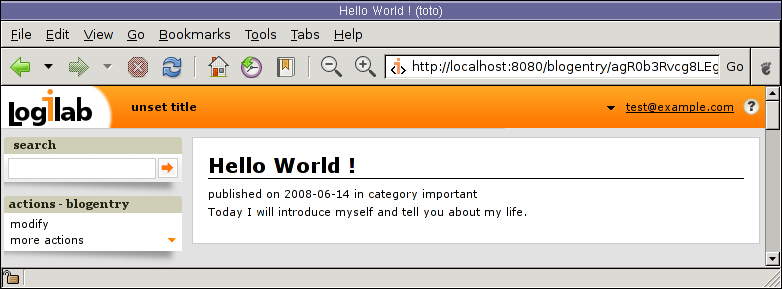

Views
-----

This chapter aims to describe the concept of a `view` used all along
the development of a web application and how it has been implemented
in `CubicWeb`.

We'll start with a description of the interface providing you with a basic
understanding of the classes and methods available, then detail the view
selection principle which makes `CubicWeb` web interface very flexible.

A `View` is an object applied to another object such as an entity.

Basic class for views
---------------------

Class `View` (`cubicweb.view`)
`````````````````````````````````````

This class is an abstraction of a view class, used as a base class for every
renderable object such as views, templates, graphic components, etc.

A `View` is instantiated to render a result set or part of a result set. `View`
subclasses may be parametrized using the following class attributes:

    * `templatable` indicates if the view may be embeded in a main
      template or if it has to be rendered standalone (i.e. XML views
      must not be embeded in the main template for HTML pages)
    * if the view is not templatable, it should set the `content_type` class
      attribute to the correct MIME type (text/xhtml by default)
    * the `category` attribute may be used in the interface to regroup related
      objects together

At instantiation time, the standard `req`, `rset`, and `cursor`
attributes are added and the `w` attribute will be set at rendering
time.

A view writes to its output stream thanks to its attribute `w` (`UStreamIO`).

The basic interface for views is as follows (remember that the result set has a
tabular structure with rows and columns, hence cells):

* `dispatch(**context)`, render the view by calling `call` or
  `cell_call` depending on the given parameters
* `call(**kwargs)`, call the view for a complete result set or null (default
  implementation calls `cell_call()` on each cell of the result set)
* `cell_call(row, col, **kwargs)`, call the view for a given cell of a result set
* `url()`, returns the URL enabling us to get the view with the current
  result set
* `view(__vid, rset, __fallback_vid=None, **kwargs)`, call the view of identifier
  `__vid` on the given result set. It is possible to give a view identifier
  of fallback that will be used if the view requested is not applicable to the
  result set

* `wview(__vid, rset, __fallback_vid=None, **kwargs)`, similar to `view` except
  the flow is automatically passed in the parameters

* `html_headers()`, returns a list of HTML headers to set by the main template

* `page_title()`, returns the title to use in the HTML header `title`


Other basic view classes
````````````````````````
Here are some of the subclasses of `View` defined in `cubicweb.common.view`
that are more concrete as they relate to data rendering within the application:

* `EntityView`, view applying to lines or cell containing an entity (e.g. an eid)
* `StartupView`, start view that does not require a result set to apply to
* `AnyRsetView`, view applied to any result set
* `EmptyRsetView`, view applied to an empty result set


Examples of views class
-----------------------

- Using `templatable`, `content_type` and HTTP cache configuration

.. code-block:: python


    class RSSView(XMLView):
        id = 'rss'
        title = _('rss')
        templatable = False
        content_type = 'text/xml'
        http_cache_manager = MaxAgeHTTPCacheManager
        cache_max_age = 60*60*2 # stay in http cache for 2 hours by default


- Using custom selector

.. code-block:: python


    class SearchForAssociationView(EntityView):
        """view called by the edition view when the user asks
        to search for something to link to the edited eid
        """
        id = 'search-associate'
        title = _('search for association')
        __select__ = one_line_rset() & match_search_state('linksearch') & implements('Any')


Example of a view customization
-------------------------------

[FIXME] XXX Example needs to be rewritten as it shows how to modify cell_call which
contredicts our advise of not modifying it.

We'll show you now an example of a ``primary`` view and how to customize it.

If you want to change the way a ``BlogEntry`` is displayed, just override
the method ``cell_call()`` of the view ``primary`` in ``BlogDemo/views.py`` ::

.. code-block:: python

   from cubicweb.view import EntityView
   from cubicweb.selectors import implements

   class BlogEntryPrimaryView(EntityView):
       id = 'primary'
       __select__ =implements('Blog')

       def cell_call(self, row, col):
           entity = self.entity(row, col)
           self.w(u'<h1>%s</h1>' % entity.title)
           self.w(u'<p>published on %s in category %s</p>' % \
                  (entity.publish_date.strftime('%Y-%m-%d'), entity.category))
           self.w(u'<p>%s</p>' % entity.text)

The above source code defines a new primary view (`line 03`) for
``BlogEntry`` (`line 05`).

Since views are applied to result sets which can be tables of
data, we have to recover the entity from its (row,col)-coordinates (`line 08`).
We will get to this in more detail later.

The view method ``self.w()`` is used to output data. Here `lines
09-12` output HTML tags and values of the entity's attributes.

When displaying the same blog entry as before, you will notice that the
page is now looking much nicer. [FIXME: it is not clear to what this refers.]



Let us now improve the primary view of a blog

.. code-block:: python

 class BlogPrimaryView(EntityView):
     id = 'primary'
     __select__ =implements('Blog')

     def cell_call(self, row, col):
         entity = self.entity(row, col)
         self.w(u'<h1>%s</h1>' % entity.title)
         self.w(u'<p>%s</p>' % entity.description)
         rset = self.req.execute('Any E WHERE E entry_of B, B eid "%s"' % entity.eid)
         self.wview('primary', rset)

In the above source code, `lines 01-08` are similar to the previous
view we defined. [FIXME: defined where ?]

At `line 09`, a simple request is made to build a result set with all
the entities linked to the current ``Blog`` entity by the relationship
``entry_of``. The part of the framework handling the request knows
about the schema and infer that such entities have to be of the
``BlogEntry`` kind and retrieves them.

The request returns a selection of data called a result set. At
`line 10` the view 'primary' is applied to this result set to output
HTML.

**This is to be compared to interfaces and protocols in object-oriented
languages. Applying a given view called 'a_view' to all the entities
of a result set only requires to have for each entity of this result set,
an available view called 'a_view' which accepts the entity.**

Assuming we added entries to the blog titled `MyLife`, displaying it
now allows to read its description and all its entries.

.. image:: ../../images/lax-book.10-blog-with-two-entries.en.png
   :alt: a blog and all its entries

**Before we move forward, remember that the selection/view principle is
at the core of `CubicWeb`. Everywhere in the engine, data is requested
using the RQL language, then HTML/XML/text/PNG is output by applying a
view to the result set returned by the query. That is where most of the
flexibility comes from.**

[WRITE ME]

* implementing interfaces, calendar for blog entries
* show that a calendar view can export data to ical

We will implement the `cubicweb.interfaces.ICalendarable` interfaces on
entities.BlogEntry and apply the OneMonthCalendar and iCalendar views
to result sets like "Any E WHERE E is BlogEntry"

* create view "blogentry table" with title, publish_date, category

We will show that by default the view that displays
"Any E,D,C WHERE E publish_date D, E category C" is the table view.
Of course, the same can be obtained by calling
self.wview('table',rset)

* in view blog, select blogentries and apply view "blogentry table"
* demo ajax by filtering blogentry table on category

we did the same with 'primary', but with tables we can turn on filters
and show that ajax comes for free.
[FILLME]


XML views, binaries...
----------------------
For views generating other formats than HTML (an image generated dynamically
for example), and which can not simply be included in the HTML page generated
by the main template (see above), you have to:

* set the attribute `templatable` of the class to `False`
* set, through the attribute `content_type` of the class, the MIME type generated
  by the view to `application/octet-stream`

For views dedicated to binary content creation (like dynamically generated
images), we have to set the attribute `binary` of the class to `True` (which
implies that `templatable == False`, so that the attribute `w` of the view could be
replaced by a binary flow instead of unicode).
