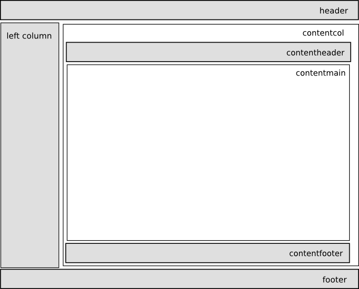

.. -*- coding: utf-8 -*-

.. |cubicweb| replace:: *CubicWeb*

.. _templates:

Templates
=========

Templates are the entry point for the |cubicweb| view system. As seen
in :ref:`views_base_class`, there are two kinds of views: the
templatable and non-templatable.

Non-templatable views are standalone. They are responsible for all the
details such as setting a proper content type (or mime type), the
proper document headers, namespaces, etc. Examples are pure xml views
such as RSS or Semantic Web views (`SIOC`_, `DOAP`_, `FOAF`_, `Linked
Data`_, etc.).

.. _`SIOC`: http://sioc-project.org/
.. _`DOAP`: http://trac.usefulinc.com/doap
.. _`FOAF`: http://www.foaf-project.org/
.. _`Linked Data`: http://linkeddata.org/

Templatable views are not concerned with such pesky details. They
leave it to the template. Conversely, the template's main job is to:

* set up the proper document header and content type
* define the general layout of a document
* invoke adequate views in the various sections of the document


Look at :mod:`cubicweb.web.views.basetemplates` and you will find the
base templates used to generate (X)HTML for your application. The most
important template there is `TheMainTemplate`.

.. _the_main_template_layout:

TheMainTemplate
---------------

.. _the_main_template_sections:

Layout and sections
```````````````````

A page is composed as indicated on the schema below :



The sections dispatches specific views:

* `header`: the rendering of the header is delegated to the
  `htmlheader` view, whose default implementation can be found in
  ``basetemplates.py`` and which does the following things:

    * inject the favicon if there is one
    * inject the global style sheets and javascript resources
    * call and display a link to an rss component if there is one available

  it also sets up the page title, and fills the actual
  `header` section with top-level components, using the `header` view, which:

    * tries to display a logo, the name of the application and the `breadcrumbs`
    * provides a login status area
    * provides a login box (hiden by default)

* `left column`: this is filled with all selectable boxes matching the
  `left` context (there is also a right column but nowadays it is
  seldom used due to bad usability)

* `contentcol`: this is the central column; it is filled with:

    * the `rqlinput` view (hidden by default)
    * the `applmessages` component
    * the `contentheader` view which in turns dispatches all available
      content navigation components having the `navtop` context (this
      is used to navigate through entities implementing the IPrevNext
      interface)
    * the view that was given as input to the template's `call`
      method, also dealing with pagination concerns
    * the `contentfooter`

* `footer`: adds all footer actions

.. note::

  How and why a view object is given to the main template is explained
  in the :ref:`publisher` chapter.

Class attributes
````````````````

We can also control certain aspects of the main template thanks to the following
forms parameters:

* `__notemplate`, if present (whatever the value assigned), only the content view
  is returned
* `__force_display`, if present and its value is not null, no navigation
  whatever the number of entities to display
* `__method`, if the result set to render contains only one entity and this
  parameter is set, it refers to a method to call on the entity by passing it
  the dictionary of the forms parameters, before going the classic way (through
  step 1 and 2 described juste above)

Other templates
---------------

Other standard templates include:

* `login` and `logout`

* `error-template` specializes TheMainTemplate to do proper end-user
  output if an error occurs during the computation of TheMainTemplate
  (it is a fallback view).
