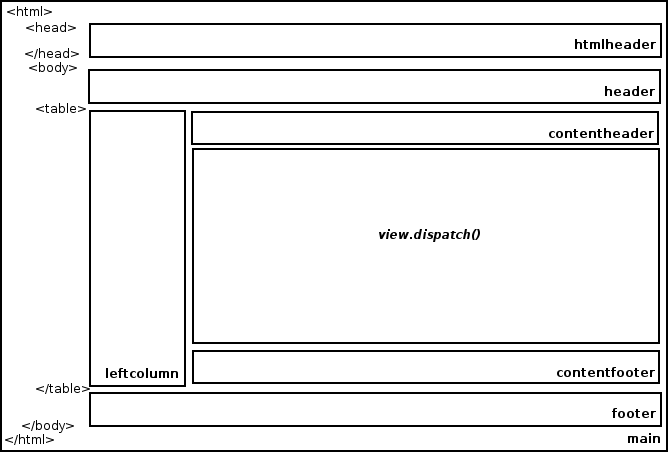
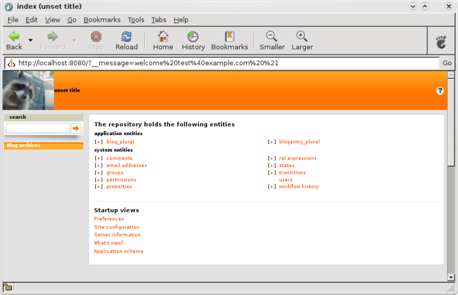

.. -*- coding: utf-8 -*-

.. _templates:

Templates
=========

[WRITE ME]

* talk about main templates, etc.

Look at ``cubicweb/web/views/basetemplates.py`` and you will
find the base templates used to generate HTML for your application.

A page is composed as indicated on the schema below :

In this section we will go through a couple of the primary templates
you must be interested in, that is to say, the HTMLPageHeader,
the HTMLPageFooter and the TheMainTemplate.

HTMLPageHeader
--------------

Customize header
~~~~~~~~~~~~~~~~

Let's now move the search box in the header and remove the login form
from the header. We'll show how to move it to the left column of the application.

Let's say we do not want anymore the login menu to be in the header, but we
prefer it to be in the left column just below the logo. As the left column is
rendered by ``TheMainTemplate``, we will show how to do it in TheMainTemplate_.

First, to remove the login menu, we just need to comment out the display of the
login component such as follows : ::

  class MyHTMLPageHeader(HTMLPageHeader):

      def main_header(self, view):
          """build the top menu with authentification info and the rql box"""
          self.w(u'<table id="header"><tr>\n')
          self.w(u'<td id="firstcolumn">')
          self._cw.vreg.select_component('logo', self._cw, self.cw_rset).dispatch(w=self.w)
          self.w(u'</td>\n')
          # appliname and breadcrumbs
          self.w(u'<td id="headtext">')
          comp = self._cw.vreg.select_component('appliname', self._cw, self.cw_rset)
          if comp and comp.propval('visible'):
              comp.dispatch(w=self.w)
          comp = self._cw.vreg.select_component('breadcrumbs', self._cw, self.cw_rset, view=view)
          if comp and comp.propval('visible'):
              comp.dispatch(w=self.w, view=view)
          self.w(u'</td>')
          # logged user and help
          #self.w(u'<td>\n')
          #comp = self._cw.vreg.select_component('loggeduserlink', self._cw, self.cw_rset)
          #comp.dispatch(w=self.w)
          #self.w(u'</td><td>')

          self.w(u'<td>')
          helpcomp = self._cw.vreg.select_component('help', self._cw, self.cw_rset)
          if helpcomp: # may not be available if Card is not defined in the schema
              helpcomp.dispatch(w=self.w)
          self.w(u'</td>')
          # lastcolumn
          self.w(u'<td id="lastcolumn">')
          self.w(u'</td>\n')
          self.w(u'</tr></table>\n')
          self.template('logform', rset=self.cw_rset, id='popupLoginBox', klass='hidden',
                        title=False, message=False)

Let's now move the search box in the top-right header area. To do so, we will
first create a method to get the search box display and insert it in the header
table.

::

 from cubicweb.web.views.basetemplates import HTMLPageHeader
 class MyHTMLPageHeader(HTMLPageHeader):
    def main_header(self, view):
        """build the top menu with authentification info and the rql box"""
        self.w(u'<table id="header"><tr>\n')
        self.w(u'<td id="firstcolumn">')
        self._cw.vreg.select_component('logo', self._cw, self.cw_rset).dispatch(w=self.w)
        self.w(u'</td>\n')
        # appliname and breadcrumbs
        self.w(u'<td id="headtext">')
        comp = self._cw.vreg.select_component('appliname', self._cw, self.cw_rset)
        if comp and comp.propval('visible'):
            comp.dispatch(w=self.w)
        comp = self._cw.vreg.select_component('breadcrumbs', self._cw, self.cw_rset, view=view)
        if comp and comp.propval('visible'):
            comp.dispatch(w=self.w, view=view)
        self.w(u'</td>')

        # logged user and help
        #self.w(u'<td>\n')
        #comp = self._cw.vreg.select_component('loggeduserlink', self._cw, self.cw_rset)
        #comp.dispatch(w=self.w)
        #self.w(u'</td><td>')

        # search box
        self.w(u'<td>')
        self.get_searchbox(view, 'left')
        self.w(u'</td>')

        self.w(u'<td>')
        helpcomp = self._cw.vreg.select_component('help', self._cw, self.cw_rset)
        if helpcomp: # may not be available if Card is not defined in the schema
            helpcomp.dispatch(w=self.w)
        self.w(u'</td>')
        # lastcolumn
        self.w(u'<td id="lastcolumn">')
        self.w(u'</td>\n')
        self.w(u'</tr></table>\n')
        self.template('logform', rset=self.cw_rset, id='popupLoginBox', klass='hidden',
                      title=False, message=False)

    def get_searchbox(self, view, context):
        boxes = list(self._cw.vreg.poss_visible_objects('boxes', self._cw, self.cw_rset,
                                                    view=view, context=context))
        if boxes:
            for box in boxes:
                if box.id == 'search_box':
                    box.dispatch(w=self.w, view=view)

HTMLPageFooter
--------------

If you want to change the footer for example, look
for HTMLPageFooter and override it in your views file as in :
::

  form cubicweb.web.views.basetemplates import HTMLPageFooter
  class MyHTMLPageFooter(HTMLPageFooter):
      def call(self, **kwargs):
          self.w(u'
')
          self.w(u'This website has been created with <a href="http://cubicweb.org">CubicWeb</a>.')
          self.w(u'
')

Updating a view does not require any restart of the server. By reloading
the page you can see your new page footer.

TheMainTemplate
---------------
.. _TheMainTemplate:

TheMainTemplate is responsible for the general layout of the entire application.
It defines the template of ``id = main`` that is used by the instance.

The default main template (`cubicweb.web.views.basetemplates.TheMainTemplate`)
builds the page based on the following pattern:

The rectangle containing `view.dispatch()` represents the area where the content
view has to be displayed. The others represents sub-templates called to complete
the page. A default implementation of those is provided in
`cubicweb.views.basetemplates`. You can, of course, overload those sub-templates
to implement your own customization of the HTML page.

We can also control certain aspects of the main template thanks to the following
forms parameters:

* `__notemplate`, if present (whatever the value assigned), only the content view
  is returned
* `__force_display`, if present and its value is not null, no navigation
  whatever the number of entities to display
* `__method`, if the result set to render contains only one entity and this
  parameter is set, it refers to a method to call on the entity by passing it
  the dictionary of the forms parameters, before going the classic way (through
  step 1 and 2 described juste above)

The MainTemplate is a bit complex as it tries to accomodate many
different cases. We are now about to go through it and cutomize entirely
our application.
