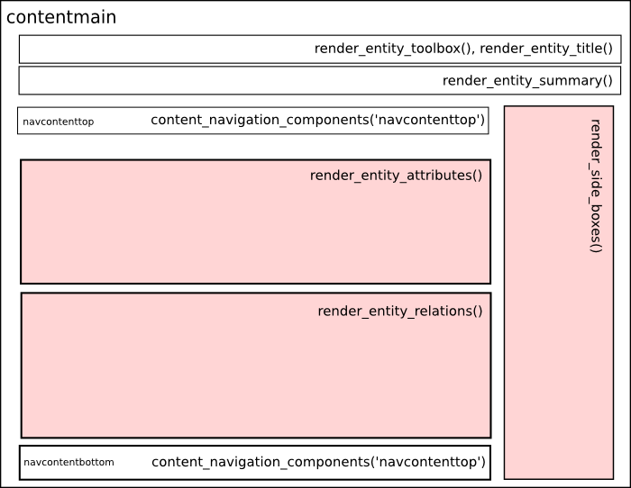

.. _primary:

The Primary View
-----------------

(:mod:`cubicweb.web.views.primary`)

By default, *CubicWeb* provides a view that fits every available
entity type. This is the first view you might be interested in
modifying. It is also one of the richest and most complex.

It is automatically selected on a one line result set containing an
entity.

This view is supposed to render a maximum of informations about the
entity.

.. _primary_view_layout:

Layout
``````

The primary view has the following layout.



.. _primary_view_configuration:

Primary view configuration
``````````````````````````

If you want to customize the primary view of an entity, overriding the primary
view class may not be necessary. For simple adjustments (attributes or relations
display locations and styles), a much simpler way is to use uicfg.

Attributes/relations display location
^^^^^^^^^^^^^^^^^^^^^^^^^^^^^^^^^^^^^

In the primary view, there are 3 sections where attributes and
relations can be displayed (represented in pink in the image above):

* attributes
* relations
* sideboxes

**Attributes** can only be displayed in the attributes section (default
  behavior). They can also be hidden.

For instance, to hide the ``title`` attribute of the ``Blog`` entity:

.. sourcecode:: python

   from cubicweb.web import uicfg
   uicfg.primaryview_section.tag_attribute(('Blog', 'title'), 'hidden')

**Relations** can be either displayed in one of the three sections or hidden.

For relations, there are two methods:

* ``tag_object_of`` for modifying the primary view of the object
* ``tag_subject_of`` for modifying the primary view of the subject

These two methods take two arguments:

* a triplet ``(subject, relation_name, object)``, where subject or object can be replaced with ``'*'``
* the section name or ``hidden``

.. sourcecode:: python

   pv_section = uicfg.primaryview_section
   # hide every relation `entry_of` in the `Blog` primary view
   pv_section.tag_object_of(('*', 'entry_of', 'Blog'), 'hidden')

   # display `entry_of` relations in the `relations`
   # section in the `BlogEntry` primary view
   pv_section.tag_subject_of(('BlogEntry', 'entry_of', '*'), 'relations')


Display content
^^^^^^^^^^^^^^^

You can use ``primaryview_display_ctrl`` to customize the display of attributes
or relations. Values of ``primaryview_display_ctrl`` are dictionaries.


Common keys for attributes and relations are:

* ``vid``: specifies the regid of the view for displaying the attribute or the relation.

  If ``vid`` is not specified, the default value depends on the section:
    * ``attributes`` section: 'reledit' view
    * ``relations`` section: 'autolimited' view
    * ``sideboxes`` section: 'sidebox' view

* ``order``: int used to control order within a section. When not specified,
  automatically set according to order in which tags are added.

.. sourcecode:: python

   # let us remind the schema of a blog entry
   class BlogEntry(EntityType):
       title = String(required=True, fulltextindexed=True, maxsize=256)
       publish_date = Date(default='TODAY')
       content = String(required=True, fulltextindexed=True)
       entry_of = SubjectRelation('Blog', cardinality='?*')

   # now, we want to show attributes
   # with an order different from that in the schema definition
   view_ctrl = uicfg.primaryview_display_ctrl
   for index, attr in enumerate('title', 'content', 'publish_date'):
       view_ctrl.tag_attribute(('BlogEntry', attr), {'order': index})

Keys for relations only:

* ``label``: label for the relations section or side box

* ``showlabel``: boolean telling whether the label is displayed

* ``limit``: boolean telling if the results should be limited. If so, a link to all results is displayed

* ``filter``: callback taking the related result set as argument and returning it filtered

.. sourcecode:: python

   pv_section = uicfg.primaryview_section
   # in `CWUser` primary view, display `created_by`
   # relations in relations section
   pv_section.tag_object_of(('*', 'created_by', 'CWUser'), 'relations')

   # display this relation as a list, sets the label,
   # limit the number of results and filters on comments
   def filter_comment(rset):
       return rset.filtered_rset(lambda x: x.e_schema == 'Comment')
   pv_ctrl = uicfg.primaryview_display_ctrl
   pv_ctrl.tag_object_of(('*', 'created_by', 'CWUser'),
                         {'vid': 'list', 'label': _('latest comment(s):'),
                          'limit': True,
                          'filter': filter_comment})

.. warning:: with the ``primaryview_display_ctrl`` rtag, the subject or the
   object of the relation is ignored for respectively ``tag_object_of`` or
   ``tag_subject_of``. To avoid warnings during execution, they should be set to
   ``'*'``.

Rendering methods and attributes
````````````````````````````````

The basic layout of a primary view is as in the
:ref:`primary_view_layout` section. This layout is actually drawn by
the `render_entity` method.

The methods you may want to modify while customizing a ``PrimaryView``
are:

*render_entity_title(self, entity)*
    Renders the entity title using the ``def dc_title(self)`` method.

*render_entity_metadata(self, entity)*
    Renders the entity metadata by calling the ``metadata`` view on the
    entity. This generic view is in cubicweb.views.baseviews.

*render_entity_attributes(self, entity)*
    Renders all the attribute of an entity with the exception of
    attribute of type `Password` and `Bytes`. The skip_none class
    attribute controls the display of None valued attributes.

*render_entity_relations(self, entity)*
    Renders all the relations of the entity in the main section of the page.

*render_side_boxes(self, entity, boxes)*
    Renders relations of the entity in a side box.

The placement of relations in the relations section or in side boxes
can be controlled through the :ref:`primary_view_configuration` mechanism.

*content_navigation_components(self, context)*
    This method is applicable only for entity type implementing the interface
    `IPrevNext`. This interface is for entities which can be linked to a previous
    and/or next entity. This method will render the navigation links between
    entities of this type, either at the top or at the bottom of the page
    given the context (navcontent{top|bottom}).

Also, please note that by setting the following attributes in your
subclass, you can already customize some of the rendering:

*show_attr_label*
    Renders the attribute label next to the attribute value if set to True.
    Otherwise, does only display the attribute value.

*show_rel_label*
    Renders the relation label next to the relation value if set to True.
    Otherwise, does only display the relation value.

*skip_none*
    Does not render an attribute value that is None if set to True.

*main_related_section*
    Renders the relations of the entity if set to True.

A good practice is for you to identify the content of your entity type for which
the default rendering does not answer your need so that you can focus on the specific
method (from the list above) that needs to be modified. We do not advise you to
overwrite ``render_entity`` unless you want a completely different layout.
