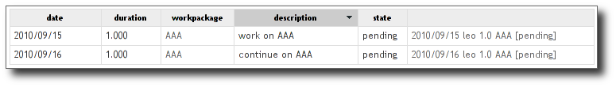
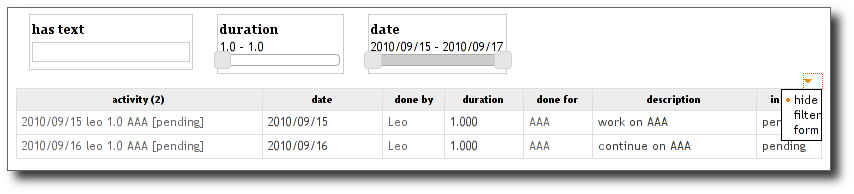

Table view
----------

(:mod:`cubicweb.web.views.tableview`)

*table*
    Creates a HTML table (`<table>`) and call the view `cell` for each cell of
    the result set. Applicable on any result set.

*editable-table*
    Creates an **editable** HTML table (`<table>`) and call the view `cell` for each cell of
    the result set. Applicable on any result set.

*cell*
    By default redirects to the `final` view if this is a final entity or
    `outofcontext` view otherwise


API
```

.. autoclass:: cubicweb.web.views.tableview.TableView
   :members:

Example
```````

Let us take an example from the timesheet cube:

.. sourcecode:: python

    class ActivityTable(EntityView):
        __regid__ = 'activitytable'
        __select__ = is_instance('Activity')
        title = _('activitytable')

        def call(self, showresource=True):
            _ = self._cw._
            headers  = [_("diem"), _("duration"), _("workpackage"), _("description"), _("state"), u""]
            eids = ','.join(str(row[0]) for row in self.cw_rset)
            rql = ('Any R, D, DUR, WO, DESCR, S, A, SN, RT, WT ORDERBY D DESC '
                   'WHERE '
                   '   A is Activity, A done_by R, R title RT, '
                   '   A diem D, A duration DUR, '
                   '   A done_for WO, WO title WT, '
                   '   A description DESCR, A in_state S, S name SN, A eid IN (%s)' % eids)
            if showresource:
                displaycols = range(7)
                headers.insert(0, display_name(self._cw, 'Resource'))
            else: # skip resource column if asked to
                displaycols = range(1, 7)
            rset = self._cw.execute(rql)
            self.wview('editable-table', rset, 'null',
                       displayfilter=True, displayactions=False,
                       headers=headers, displaycols=displaycols,
                       cellvids={3: 'editable-final'})

To obtain an editable table, specify 'edtitable-table' as vid. You
have to select the entity in the rql request too (in order to kwnow
which entity must be edited). You can specify an optional
`displaycols` argument which defines column's indexes that will be
displayed. In the above example, setting `showresource` to `False`
will only render columns from index 1 to 7.

The previous example results in:




In order to activate table filter mechanism, set the `displayfilter`
argument to True. A small arrow will be displayed at the table's top
right corner. Clicking on `show filter form` action, will display the
filter form as below:



By the same way, you can display all registered actions for the
selected entity, setting `displayactions` argument to True.
