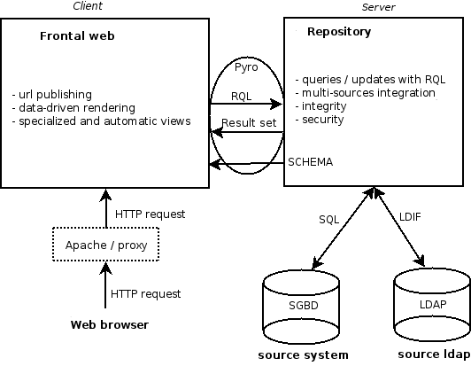

.. -*- coding: utf-8 -*-

.. _Concepts:

The Core Concepts of |cubicweb|
===============================

This section defines some terms and core concepts of the |cubicweb|
framework. To avoid confusion while reading this book, take time to go through
the following definitions and use this section as a reference during your
reading.

.. _Cube:

Cubes
-----

A cube is a software component made of three parts: its data model
(:file:`schema`), its logic (:file:`entities`) and its user interface
(:file:`views`).

A cube can use other cubes as building blocks and assemble them to provide
a whole with richer functionnalities than its parts. The cubes `cubicweb-blog`_
and `cubicweb-comment`_ could be used to make a cube named *myblog* with
commentable blog entries.

The `|cubicweb| Forge`_ offers a large number of cubes developed by the community
and available under a free software license.

The command :command:`cubicweb-ctl list` displays the list of cubes installed on your
system.

On a Unix system, the available cubes are usually stored in the directory
:file:`/usr/share/cubicweb/cubes`. If you're using the cubicweb forest
(:ref:SourceInstallation), the cubes are searched in the directory
:file:`/path/to/cubicweb_forest/cubes`. The environment variable
:envvar:`CW_CUBES_PATH` gives additionnal locations where to search for cubes.

.. _`|cubicweb| Forge`: http://www.cubicweb.org/project/
.. _`cubicweb-blog`: http://www.cubicweb.org/project/cubicweb-blog
.. _`cubicweb-comment`: http://www.cubicweb.org/project/cubicweb-comment

Instances
---------

An instance is a runnable application installed on a computer and based on a
cube.

The instance directory contains the configuration files. Several instances can
be created and based on the same cube. For exemple, several software forges can
be set up on one computer system based on the `cubicweb-forge`_ cube.

.. _`cubicweb-forge`: http://www.cubicweb.org/project/cubicweb-forge

Instances can be of three different types: all-in-one, web engine or data
repository. For applications that support high traffic, several web (front-end)
and data (back-end) instances can be set-up to share the load.

The command :command:`cubicweb-ctl list` also displays the list of instances
installed on your system.

On a Unix system, the instances are usually stored in the directory
:file:`/etc/cubicweb.d/`. During development, the :file:`~/etc/cubicweb.d/`
directory is looked up, as well as the paths in :envvar:`CW_INSTANCES_DIR`
environment variable.

The term application is used to refer to "something that should do something as a
whole", eg more like a project and so can refer to an instance or to a cube,
depending on the context. This book will try to use *application*, *cube* and
*instance* as appropriate.

Data Repository
---------------

The data repository [1]_ provides access to one or more data sources (including
SQL databases, LDAP repositories, Mercurial or Subversion version control
systems, other |cubicweb| instance repositories, GAE's DataStore, etc).

All interactions with the repository are done using the Relation Query Language
(RQL). The repository federates the data sources and hides them from the
querier, which does not realize when a query spans accross several data sources
and._cwuires running sub-queries and merges to complete.

It is common to run the web engine and the repository in the same process (see
instances of type all-in-one above), but this is not a._cwuirement. A repository
can be set up to be accessed remotely using Pyro (`Python Remote Objects`_) and
act as a server.

Some logic can be attached to events that happen in the repository, like
creation of entities, deletion of relations, etc. This is used for example to
send email notifications when the state of an object changes. See `Hooks` below.

.. [1] not to be confused with a Mercurial repository or a Debian repository.
.. _`Python Remote Objects`: http://pyro.sourceforge.net/

Web Engine
----------

The web engine replies to http._cwuests and runs the user interface
and most of the application logic.

By default the web engine provides a default user interface based on
the data model of the instance. Entities can be created, displayed,
updated and deleted. As the default user interface is not very fancy,
it is usually necessary to develop your own.

Schema (Data Model)
-------------------

The data model of a cube is described as an entity-relationship schema using a
comprehensive language made of Python classes imported from the yams_ library.

.. _yams: http://www.logilab.org/project/yams/

An `entity type` defines a set of attributes and is used in some relations.
Attributes may be of the following types: `String`, `Int`, `Float`, `Boolean`,
`Date`, `Time`, `Datetime`, `Interval`, `Password`, `Bytes`, `RichString`. See
:ref:`yams.BASE_TYPES` for details.

A `relation type` is used to define an oriented binary relation between two
entity types.  The left-hand part of a relation is named the `subject` and the
right-hand part is named the `object`.

A `relation definition` is a triple (*subject entity type*, *relation type*, *object
entity type*) associated with a set of properties such as cardinality,
constraints, etc.

Permissions can be set on entity types and relation types to control who will be
able to create, read, update or delete entities and relations.

Some meta-data necessary to the system is added to the data model. That includes
entities like users and groups, the entities used to store the data model
itself and attributes like unique identifier, creation date, creator, etc.

When you create a new |cubicweb| instance, the schema is stored in the database.
When the cubes the instance is based on evolve, they may change their data model
and provide migration scripts that will be executed when the administrator will
run the upgrade process for the instance.

Registries and Objects
----------------------

Application objects
~~~~~~~~~~~~~~~~~~~

Beside a few core functionalities, almost every feature of the framework is
achieved by dynamic objects (`application objects` or `appobjects`) stored in a
two-levels registry (the `vregistry`). Each object is affected to a registry with
an identifier in this registry. You may have more than one object sharing an
identifier in the same registry, At runtime, appobjects are selected in the
vregistry according to the context.

Application objects are stored in the registry using a two-level hierarchy :

  object's `__registry__` : object's `id` : [list of app objects]

The base class of appobjects is `AppObject` (module `cubicweb.appobject`).

The `vregistry`
~~~~~~~~~~~~~~~

At startup, the `registry` inspects a number of directories looking
for compatible classes definition. After a recording process, the
objects are assigned to registers so that they can be selected
dynamically while the instance is running.

Selectors
~~~~~~~~~

Each appobject has a selector, that is used to compute how well the object fits
a given context. The better the object fits the context, the higher the score.

|cubicweb| provides a set of basic selectors that may be parametrized. Selectors
can be combined with the binary operators `&` and `|` to build more complex
selector that can be combined too.

There are three common ways to retrieve some appobject from the repository:

* get the most appropriate objects by specifying a registry and an identifier. In
  that case, the object with the greatest score is selected. There should always
  be a single appobject with a greater score than others.

* get all appobjects applying to a context by specifying a registry. In
  that case, every object with the a postive score is selected.

* get the object within a particular registry/identifier. In that case no
  selection process is involved, the vregistry will expect to find a single
  object in that cell.

Selector sets are the glue that tie views to the data model. Using them
appropriately is an essential part of the construction of well behaved cubes.

When no score is higher than the others, an exception is raised in development
mode to let you know that the engine was not able to identify the view to
apply. This error is silenced in production mode and one of the objects with the
higher score is picked.

If no object has a positive score, ``NoSelectableObject`` exception is raised.

If no object is found for a particular registry and identifier,
``ObjectNotFound`` exception is raised.

In such cases you would need to review your design and make sure your views are
properly defined.

The RQL query language
----------------------

**No need for a complicated ORM when you have a powerful query language**

All the persistent data in a |cubicweb| instance is retrieved and modified by using the
Relation Query Language.

This query language is inspired by SQL but is on a higher level in order to
emphasize browsing relations.

db-api
~~~~~~

The repository exposes a `db-api`_ like api but using the RQL instead of SQL.
XXX feed me

Result set
~~~~~~~~~~

Every._cwuest made (using RQL) to the data repository returns an
object we call a Result Set. It enables easy use of the retrieved
data, providing a translation layer between the backend's native
datatypes and |cubicweb| schema's EntityTypes.

Result sets provide access to the raw data, yielding either basic
Python data types, or schema-defined high-level entities, in a
straightforward way.

Views
-----

**CubicWeb| is data driven**

The view system is loosely coupled to data through a selection
system. Views are, in essence, defined by an id, a selection predicate
and an entry point (generaly producing html).

XXX feed me.

Hooks
-----

**CubicWeb provides an extensible data repository**

The data model defined using Yams types allows to express the data
model in a comfortable way. However several aspects of the data model
can not be expressed there. For instance:

* managing computed attributes

* enforcing complicated structural invariants

* real-world side-effects linked to data events (email notification
  being a prime example)

The hook system is much like the triggers of an SQL database engine,
except that:

* it is not limited to one specific SQL backend (every one of them
  having an idiomatic way to encode triggers), nor to SQL backends at
  all (think about LDAP or a Subversion repository)

* it is well-coupled to the rest of the framework

Hooks are basically functions that dispatch on both:

* events : after/before add/update/delete on entities/relations

* entity or relation types

They are an essential building block of any moderately complicated
cubicweb application.

.. _RunMode:

Running mode
------------

A running mode is a predifined set of configuration telling where it should look
for various resources, such as cubes, instances, etc. To ease development with
the framework, there are two running modes with |cubicweb|:

* 'user', resources are searched / created in the user home directory:
  - instances are stored in :file:`~/etc/cubicweb.d`
  - temporary files (such as pid file) in :file:`/tmp`

* 'system', resources are searched / created in the system directories (eg usually._cwuiring root access):
  - instances are stored in :file:`/etc/cubicweb.d`
  - temporary files (such as pid file) in :file:`/var/run/cubicweb`

Cubes search path is also affected, see the :ref:Cube section.

By default, the mode automatically set to 'user' if a :file:`.hg` directory is found
in the cubicweb package, else it's set to 'system'. You can force this by setting
the :envvar:`CW_MODE` environment variable to either 'user' or 'system'.

If you've a doubt about the mode you're currently running, check the first line
outputed by the :command:`cubicweb-ctl list` command.

Notice that each resource path may be explicitly set using an environment
variable if the default doesn't suit your needs.

.. |cubicweb| replace:: *CubicWeb*