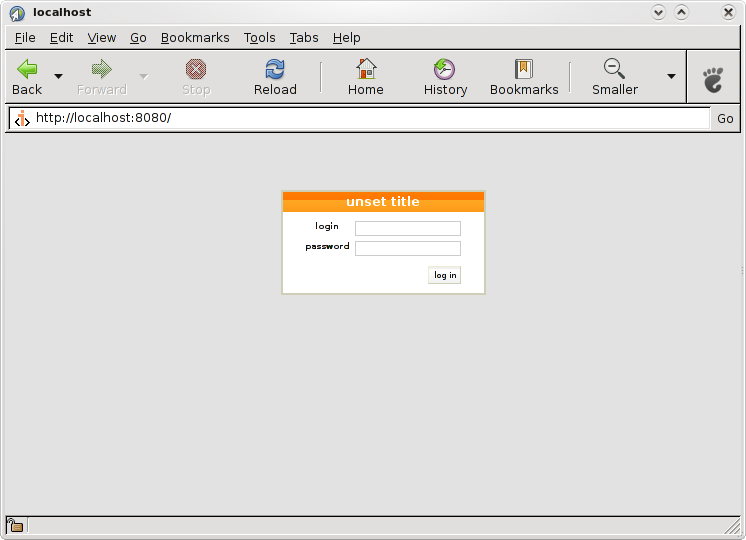
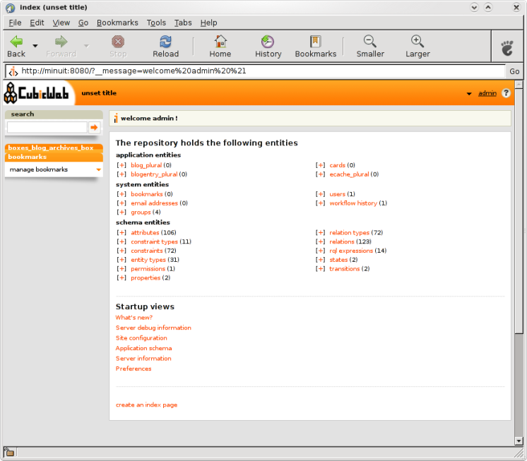
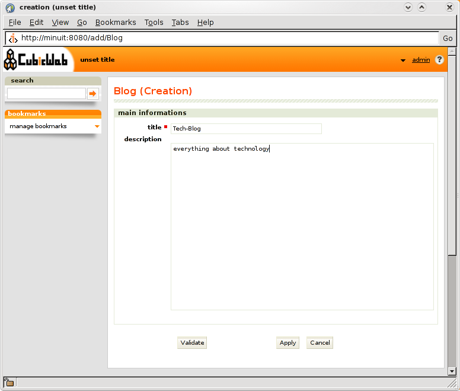
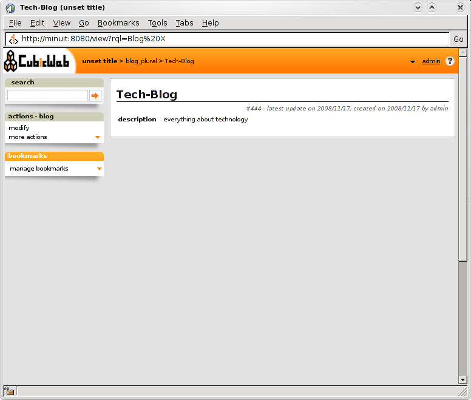
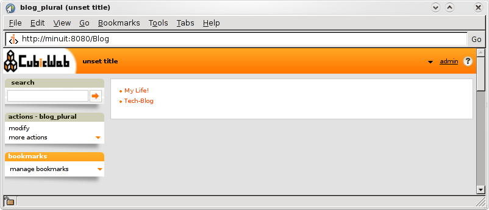
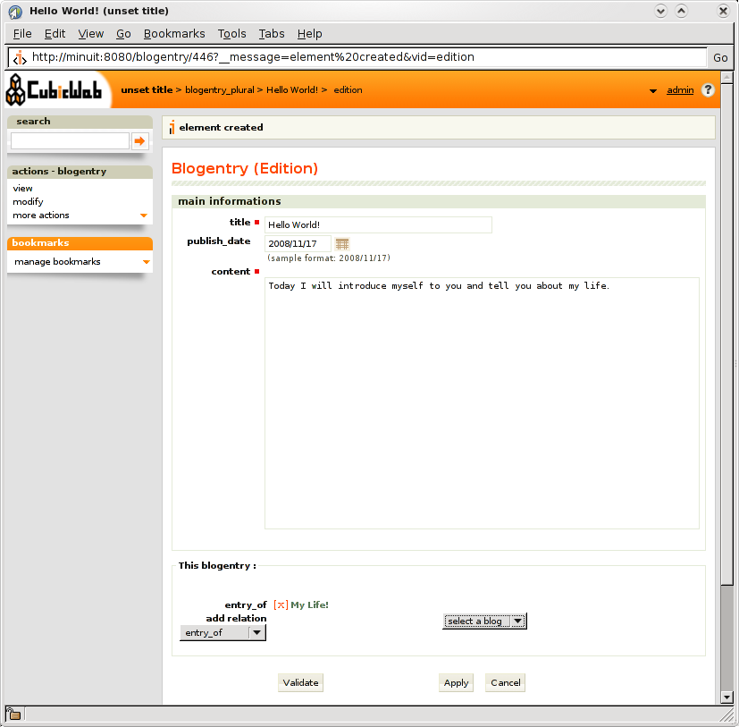
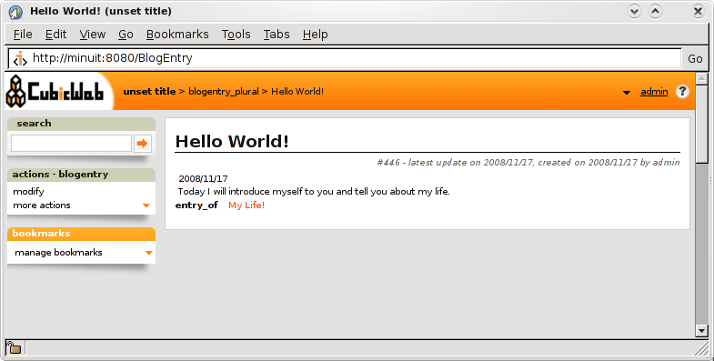
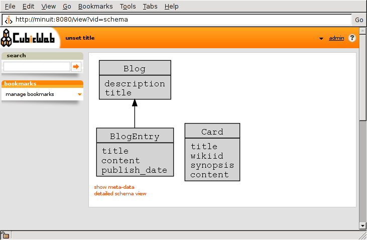
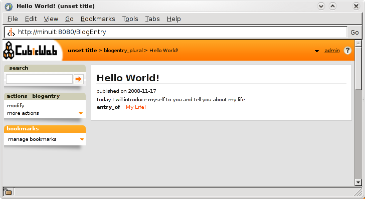

.. -*- coding: utf-8 -*-

.. _Steps:

Steps for creating your cube
----------------------------

The following steps will help you to create and customize a new cube.

1. :ref:`CreateYourCube`

Create the directory to hold the code of your cube. The most important files that will be useful to customize your newly created cube are:
  * schema.py: contains the data model
  * views.py: contains your custom views
  * entities.py: contains XXX 
The detailed structure of the code directory is described in :ref:`cubelayout`.

2. :ref:`DefineDataModel`

Define the data model of your application.

3. :ref:`ExploreYourInstance`

Create, run, and explore an instance of your cube.

4. :ref:`DefineViews`

Customize the views of your data: how and which part of your data are showed. 

Note: views don't concern the look'n'feel or design of the site. For that, you should use CSS instead, and default CSS or your new cube are located in 'blog/data/'.

5. :ref:`DefineEntities`

Define your own entities to add useful functions when you manipulate your data, especially when you write view.

.. _CreateYourCube:

Create your cube
----------------

The packages ``cubicweb`` and ``cubicweb-dev`` install a command line
tool for *CubicWeb* called ``cubicweb-ctl``. This tool provides a wide
range of commands described in details in :ref:`cubicweb-ctl`.

Once your *CubicWeb* development environment is set up, you can create
a new cube::

  cubicweb-ctl newcube blog

This will create in the cubes directory (``/path/to/forest/cubes`` for Mercurial
installation, ``/usr/share/cubicweb/cubes`` for debian packages installation)
a directory named ``blog`` reflecting the structure described in :ref:`Concepts`.

For packages installation, you can still create new cubes in your home directory using the following configuration. Let's say you want to develop your new cubes in `~src/cubes`, then set the following environment variables:
::

  CW_CUBES_PATH=~/src/cubes
  CW_MODE=user

and then create your new cube using:
::

  cubicweb-ctl newcube --directory=~/src/cubes blog

.. _DefineDataModel:

Define your data model
----------------------

The data model or schema is the core of your *CubicWeb* application.
It defines the type of content your application will handle.

The data model of your cube ``blog`` is defined in the file ``schema.py``:

.. sourcecode:: python

  from yams.buildobjs import EntityType, String, SubjectRelation, Date

  class Blog(EntityType):
    title = String(maxsize=50, required=True)
    description = String()

  class BlogEntry(EntityType):
    title = String(required=True, fulltextindexed=True, maxsize=256)
    publish_date = Date(default='TODAY')
    content = String(required=True, fulltextindexed=True)
    entry_of = SubjectRelation('Blog', cardinality='?*')

The first step is the import of the EntityType (generic class for entity and 
attributes that will be used in both Blog and BlogEntry entities. 

A Blog has a title and a description. The title is a string that is
required and must be less than 50 characters.  The
description is a string that is not constrained.

A BlogEntry has a title, a publish_date and a content. The title is a
string that is required and must be less than 100 characters. The
publish_date is a Date with a default value of TODAY, meaning that
when a BlogEntry is created, its publish_date will be the current day
unless it is modified. The content is a string that will be indexed in
the database full-text index and has no constraint.

A BlogEntry also has a relationship ``entry_of`` that links it to a
Blog. The cardinality ``?*`` means that a BlogEntry can be part of
zero or one Blog (``?`` means `zero or one`) and that a Blog can
have any number of BlogEntry (``*`` means `any number including
zero`). For completeness, remember that ``+`` means `one or more`.

.. _ExploreYourInstance:

Create and explore your instance
--------------------------------
.. _CreateYourInstance:

Create your instance
~~~~~~~~~~~~~~~~~~~~

To use this cube as an instance and create a new instance named ``blogdemo``, do::

  cubicweb-ctl create blog blogdemo

This command will create the corresponding database and initialize it.

.. _WelcomeToYourWebInstance:

Welcome to your web instance
~~~~~~~~~~~~~~~~~~~~~~~~~~~~

Start your instance in debug mode with the following command: ::

  cubicweb-ctl start -D blogdemo

You can now access your web instance to create blogs and post messages
by visiting the URL http://localhost:8080/.

A login form will appear. By default, the instance will not allow anonymous
users to enter the instance. To login, you need then use the admin account
you created at the time you initialized the database with ``cubicweb-ctl
create``.

Once authenticated, you can start playing with your instance
and create entities.

Please notice that so far, the *CubicWeb* framework managed all aspects of
the web application based on the schema provided at the beginning.

.. _AddEntities:

Add entities
~~~~~~~~~~~~

We will now add entities in our web application.

Add a Blog
**********

Let us create a few of these entities. Click on the `[+]` at the left of the
link Blog on the home page. Call this new Blog ``Tech-blog`` and type in
``everything about technology`` as the description, then validate the form by
clicking on ``Validate``.

Click on the logo at top left to get back to the home page, then
follow the Blog link that will list for you all the existing Blog.
You should be seeing a list with a single item ``Tech-blog`` you
just created.

Clicking on this item will get you to its detailed description except
that in this case, there is not much to display besides the name and
the phrase ``everything about technology``.

Now get back to the home page by clicking on the top-left logo, then
create a new Blog called ``MyLife`` and get back to the home page
again to follow the Blog link for the second time. The list now
has two items.

Add a BlogEntry
***************

Get back to the home page and click on [+] at the left of the link
BlogEntry. Call this new entry ``Hello World`` and type in some text
before clicking on ``Validate``. You added a new blog entry without
saying to what blog it belongs. There is a box on the left entitled
``actions``, click on the menu item ``modify``. You are back to the form
to edit the blog entry you just created, except that the form now has
another section with a combobox titled ``add relation``. Chose
``entry_of`` in this menu and a second combobox appears where you pick
``MyLife``.

You could also have, at the time you started to fill the form for a
new entity BlogEntry, hit ``Apply`` instead of ``Validate`` and the
combobox titled ``add relation`` would have showed up.

Validate the changes by clicking ``Validate``. The entity BlogEntry
that is displayed now includes a link to the entity Blog named
``MyLife``.

Note that all of this was handled by the framework and that the only input
that was provided so far is the schema. To get a graphical view of the schema,
point your browser to the URL http://localhost:8080/schema

.. _DefineViews:

Define your entity views
------------------------

Each entity defined in a model is associated with default views
allowing different rendering of the data. You can redefine each of
them according to your needs and preferences. So let's see how the
views are defined.

The view selection principle
~~~~~~~~~~~~~~~~~~~~~~~~~~~~

A view is defined by a Python class which includes:

  - an identifier (all objects in *CubicWeb* are recorded in a
    registry and this identifier will be used as a key)

  - a filter to select the result sets it can be applied to

A view has a set of methods complying with the `View` class interface
(`cubicweb.common.view`).

*CubicWeb* provides a lot of standard views for the type `EntityView`;
for a complete list, read the code in directory ``cubicweb/web/views/``.

A view is applied on a `result set` which contains a set of entities
we are trying to display. *CubicWeb* uses a selector mechanism which
computes for each available view a score: the view with the highest
score is then used to display the given `result set`.  The standard
library of selectors is in ``cubicweb.selector``.

It is possible to define multiple views for the same identifier
and to associate selectors and filters to allow the application
to find the most appropriate way to render the data.

For example, the view named ``primary`` is the one used to display a
single entity. We will now show you how to create a primary view for
BlogEntry.

Primary view customization
~~~~~~~~~~~~~~~~~~~~~~~~~~

If you wish to modify the way a `BlogEntry` is rendered, you will have
to subclass the `primary` view, for instance in the module ``views``
of the cube ``cubes/blog/views.py``.

The standard primary view is the most sophisticated view of all. It
has more than a call() method. It is a template. Actually the entry
point calls the following sequence of (redefinable) methods:

 * render_entity_title

 * render_entity_metadata

 * render_entity_attributes

 * render_entity_relations

 * render_side_boxes

Excepted side boxes, we can see all of them already in action in the
blog entry view. This is all described in more details in
:ref:`primary`.

We can for example add in front of the publication date a prefix
specifying that the date we see is the publication date.

To do so, please apply the following changes:

.. sourcecode:: python

  from cubicweb.selectors import implements
  from cubicweb.web.views import primary

  class BlogEntryPrimaryView(primary.PrimaryView):
      __select__ = implements('BlogEntry')

      def render_entity_attributes(self, entity):
          self.w(u'
published on %s
' %
                 entity.publish_date.strftime('%Y-%m-%d'))
          super(BlogEntryPrimaryView, self).render_entity_attributes(entity)

.. note::
  When a view is modified, it is not required to restart the instance
  server. Save the Python file and reload the page in your web browser
  to view the changes.

You can now see that the publication date has a prefix.

The above source code defines a new primary view for ``BlogEntry``.

Since views are applied to result sets and result sets can be tables of
data, we have to recover the entity from its (row,col)-coordinates.
The view has a ``self.w()`` method that is used to output data, in our
example HTML output.

.. note::
   You can find more details about views and selectors in :ref:`ViewDefinition`.

.. _DefineEntities:

Write entities to add logic in your data
----------------------------------------

By default, CubicWeb provides a default entity for each data type defined in the schema. 
A default entity mainly contains the attributes defined in the data model. 

You can redefine each entity to provide additional functions to help you write your views. 

.. sourcecode:: python

    from cubicweb.entities import AnyEntity

    class BlogEntry(AnyEntity):
        """customized class for BlogEntry entities"""
    	__regid__ = 'BlogEntry'
    	__implements__ = AnyEntity.__implements__ 

        def display_cw_logo(self):
            if 'CW' in self.title:
                return True
            else:	
                return False

Customizing an entity requires that your entity:
 - inherits from ``cubicweb.entities`` or any subclass
 - defines a ``__regid__`` linked to the corresponding data type of your schema
 - implements the base class by explicitly using ``__implements__``.

We implemented here a function ``display_cw_logo`` which tests if the blog entry title contains 'CW'.
This function can then be used when you customize your views. For instance, you can modify your previous ``views.py`` as follows:

.. sourcecode:: python

 class BlogEntryPrimaryView(primary.PrimaryView):
     __select__ = implements('BlogEntry')

     ...

     def render_entity_title(self, entity):
	 if entity.display_cw_logo():
	     self.w(u'<image src="http://www.cubicweb.org/doc/en/_static/cubicweb.png"/>')
	 super(BlogEntryPrimaryView, self).render_entity_title(entity)

Then each blog entry whose title contains 'CW' is shown with the CubicWeb logo in front of it.

.. _UpdatingSchemaAndSynchronisingInstance

Updating the schema and synchronising the instance
--------------------------------------------------

While developping your cube, you may want to update your data model. Let's say you
want to add a ``category`` attribute in the ``Blog`` data type. This is called a migration.

The required steps are:
1. modify the file ``schema.py``. The ``Blog`` class looks now like this:

.. sourcecode:: python

 class Blog(EntityType):
   title = String(maxsize=50, required=True)
   description = String()
   category = String(required=True, vocabulary=(_('Professional'), _('Personal')), default='Personal')

2. stop your ``blogdemo`` instance

3. start the cubicweb shell for your instance by running the following command:

.. sourcecode:: bash

  cubicweb-ctl shell blogdemo

4. in the shell, execute:

.. sourcecode:: python

 add_attribute('Blog', 'category')

5. you can restart your instance, modify a blog entity and check that the new attribute 
``category`` has been added.

Of course, you may also want to add relations, entity types, ... See :ref:`migration`
for a list of all available migration commands.

