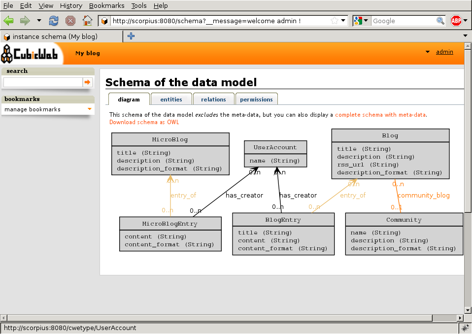
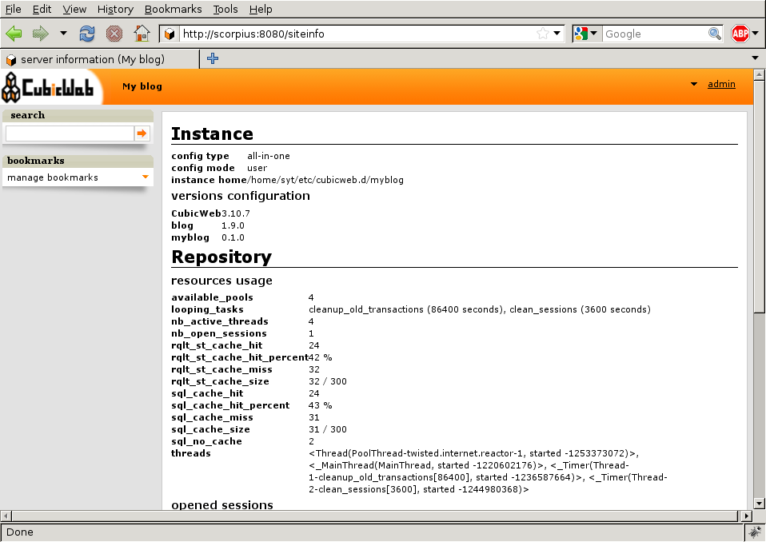
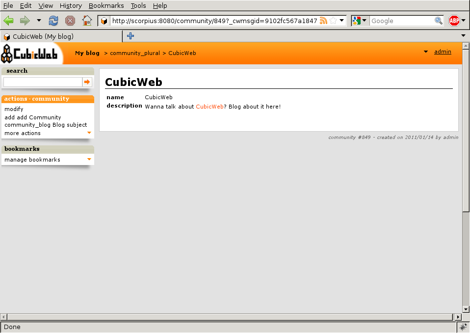
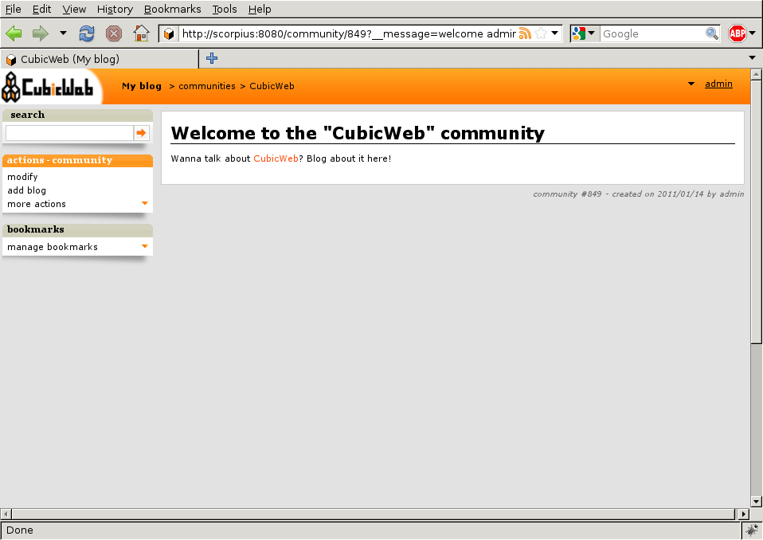
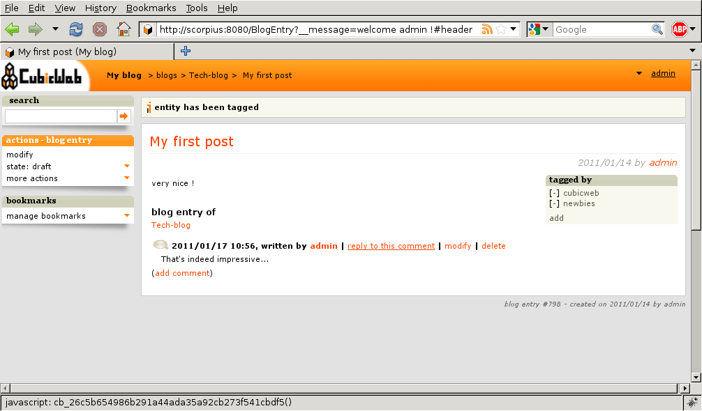
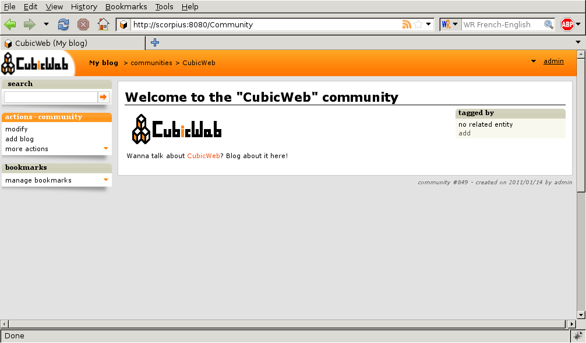

.. -*- coding: utf-8 -*-

.. _TutosBaseCustomizingTheApplication:

Customizing your application
----------------------------

So far so good. The point is that usually, you won't get enough by assembling
cubes out-of-the-box. You will want to customize them, have a personal look and
feel, add your own data model and so on. Or maybe start from scratch?

So let's get a bit deeper and start coding our own cube. In our case, we want
to customize the blog we created to add more features to it.

Create your own cube
~~~~~~~~~~~~~~~~~~~~

First, notice that if you've installed |cubicweb| using Debian packages, you will
need the additional ``cubicweb-dev`` package to get the commands necessary to
|cubicweb| development. All `cubicweb-ctl` commands are described in details in
:ref:`cubicweb-ctl`.

Once your |cubicweb| development environment is set up, you can create a new
cube::

  cubicweb-ctl newcube myblog

This will create in the cubes directory (:file:`/path/to/grshell/cubes` for source
installation, :file:`/usr/share/cubicweb/cubes` for Debian packages installation)
a directory named :file:`blog` reflecting the structure described in
:ref:`cubelayout`.

For packages installation, you can still create new cubes in your home directory
using the following configuration. Let's say you want to develop your new cubes
in `~src/cubes`, then set the following environment variables: ::

  CW_CUBES_PATH=~/src/cubes

and then create your new cube using: ::

  cubicweb-ctl newcube --directory=~/src/cubes myblog

.. Note::

   We previously used `myblog` as the name of our *instance*. We're now creating
   a *cube* with the same name. Both are different things. We'll now try to
   specify when we talk about one or another, but keep in mind this difference.

Cube metadata
~~~~~~~~~~~~~

A simple set of metadata about your cube are stored in the :file:`__pkginfo__.py`
file. In our case, we want to extend the blog cube, so we have to tell that our
cube depends on this cube, by modifying the ``__depends__`` dictionary in that
file:

.. sourcecode:: python

   __depends__ =  {'cubicweb': '>= 3.10.7',
                   'cubicweb-blog': None}

where the ``None`` means we do not depends on a particular version of the cube.

.. _TutosBaseCustomizingTheApplicationDataModel:

Extending the data model
~~~~~~~~~~~~~~~~~~~~~~~~

The data model or schema is the core of your |cubicweb| application.  It defines
the type of content your application will handle. It is defined in the file
:file:`schema.py` of the cube.

Defining our model
******************

For the sake of example, let's say we want a new entity type named `Community`
with a name, a description. A `Community` will hold several blogs.

.. sourcecode:: python

  from yams.buildobjs import EntityType, RelationDefinition, String, RichString

  class Community(EntityType):
      name = String(maxsize=50, required=True)
      description = RichString()

  class community_blog(RelationDefinition):
      subject = 'Community'
      object = 'Blog'
      cardinality = '*?'
      composite = 'subject'

The first step is the import from the :mod:`yams` package necessary classes to build
the schema.

This file defines the following:

* a `Community` has a title and a description as attributes

  - the name is a string that is required and can't be longer than 50 characters

  - the description is a string that is not constrained and may contains rich
    content such as HTML or Restructured text.

* a `Community` may be linked to a `Blog` using the `community_blog` relation

  - ``*`` means a community may be linked to 0 to N blog, ``?`` means a blog may
    be linked to 0 to 1 community. For completeness, remember that you can also
    use ``+`` for 1 to N, and ``1`` for single, mandatory relation (e.g. one to one);

  - this is a composite relation where `Community` (e.g. the subject of the
    relation) is the composite. That means that if you delete a community, its
    blog will be deleted as well.

Of course, there are a lot of other data types and things such as constraints,
permissions, etc, that may be defined in the schema, but those won't be covered
in this tutorial.

Notice that our schema refers to the `Blog` entity type which is not defined
here.  But we know this type is available since we depend on the `blog` cube
which is defining it.

Applying changes to the model into our instance
***********************************************

Now the problem is that we created an instance using the `blog` cube, not our
`myblog` cube, so if we don't do anything there is no way that we'll see anything
changing in the instance.

One easy way, as we've no really valuable data in the instance would be to trash and recreated it::

  cubicweb-ctl stop myblog # or Ctrl-C in the terminal running the server in debug mode
  cubicweb-ctl delete myblog
  cubicweb-ctl create myblog
  cubicweb-ctl start -D myblog

Another way is to add our cube to the instance using the cubicweb-ctl shell
facility. It's a python shell connected to the instance with some special
commands available to manipulate it (the same as you'll have in migration
scripts, which are not covered in this tutorial). In that case, we're interested
in the `add_cube` command: ::

  $ cubicweb-ctl stop myblog # or Ctrl-C in the terminal running the server in debug mode
  $ cubicweb-ctl shell myblog
  entering the migration python shell
  just type migration commands or arbitrary python code and type ENTER to execute it
  type "exit" or Ctrl-D to quit the shell and resume operation
  >>> add_cube('myblog')
  >>>
  $ cubicweb-ctl start -D myblog

The `add_cube` command is enough since it automatically updates our
application to the cube's schema. There are plenty of other migration
commands of a more finer grain. They are described in :ref:`migration`

As explained, leave the shell by typing Ctrl-D. If you restart the instance and
take another look at the schema, you'll see that changes to the data model have
actually been applied (meaning database schema updates and all necessary stuff
has been done).

If you follow the 'info' link in the user pop-up menu, you'll also see that the
instance is using blog and myblog cubes.

You can now add some communities, link them to blog, etc... You'll see that the
framework provides default views for this entity type (we have not yet defined any
view for it!), and also that the blog primary view will show the community it's
linked to if any. All this thanks to the model driven interface provided by the
framework.

You'll then be able to redefine each of them according to your needs
and preferences. We'll now see how to do such thing.

.. _TutosBaseCustomizingTheApplicationCustomViews:

Defining your views
~~~~~~~~~~~~~~~~~~~

|cubicweb| provides a lot of standard views in directory
:file:`cubicweb/web/views/`. We already talked about 'primary' and 'list' views,
which are views which apply to one ore more entities.

A view is defined by a python class which includes:

  - an identifier: all objects used to build the user interface in |cubicweb| are
    recorded in a registry and this identifier will be used as a key in that
    registry. There may be multiple views for the same identifier.

  - a *selector*, which is a kind of filter telling how well a view suit to a
    particular context. When looking for a particular view (e.g. given an
    identifier), |cubicweb| computes for each available view with that identifier
    a score which is returned by the selector. Then the view with the highest
    score is used. The standard library of predicates is in
    :mod:`cubicweb.predicates`.

A view has a set of methods inherited from the :class:`cubicweb.view.View` class,
though you usually don't derive directly from this class but from one of its more
specific child class.

Last but not least, |cubicweb| provides a set of default views accepting any kind
of entities.

Want a proof? Create a community as you've already done for other entity types
through the index page, you'll then see something like that:

If you notice the weird messages that appear in the page: those are messages
generated for the new data model, which have no translation yet. To fix that,
we'll have to use dedicated `cubicweb-ctl` commands:

.. sourcecode: bash

  cubicweb-ctl i18ncube myblog # build/update cube's message catalogs
  # then add translation into .po file into the cube's i18n directory
  cubicweb-ctl i18ninstance myblog # recompile instance's message catalogs
  cubicweb-ctl restart -D myblog # instance has to be restarted to consider new catalogs

You'll then be able to redefine each of them according to your needs and
preferences. So let's see how to do such thing.

Changing the layout of the application
~~~~~~~~~~~~~~~~~~~~~~~~~~~~~~~~~~~~~~

The layout is the general organization of the pages in the site. Views that generate
the layout are sometimes referred to as 'templates'. They are implemented in the
framework in the module :mod:`cubicweb.web.views.basetemplates`. By overriding
classes in this module, you can customize whatever part you wish of the default
layout.

But notice that |cubicweb| provides many other ways to customize the
interface, thanks to actions and components (which you can individually
(de)activate, control their location, customize their look...) as well as
"simple" CSS customization. You should first try to achieve your goal using such
fine grained parametrization rather then overriding a whole template, which usually
embeds customisation access points that you may loose in the process.

But for the sake of example, let's say we want to change the generic page
footer...  We can simply add to the module ``views`` of our cube,
e.g. :file:`cubes/myblog/views.py`, the code below:

.. sourcecode:: python

  from cubicweb.web.views import basetemplates

  class MyHTMLPageFooter(basetemplates.HTMLPageFooter):

      def footer_content(self):
	  self.w(u'This website has been created with <a href="http://cubicweb.org">CubicWeb</a>.')

  def registration_callback(vreg):
      vreg.register_all(globals().values(), __name__, (MyHTMLPageFooter,))
      vreg.register_and_replace(MyHTMLPageFooter, basetemplates.HTMLPageFooter)

* Our class inherits from the default page footer to ease getting things right,
  but this is not mandatory.

* When we want to write something to the output stream, we simply call `self.w`,
  with *must be passed an unicode string*.

* The latest function is the most exotic stuff. The point is that without it, you
  would get an error at display time because the framework wouldn't be able to
  choose which footer to use between :class:`HTMLPageFooter` and
  :class:`MyHTMLPageFooter`, since both have the same selector, hence the same
  score...  In this case, we want our footer to replace the default one, so we have
  to define a :func:`registration_callback` function to control object
  registration: the first instruction tells to register everything in the module
  but the :class:`MyHTMLPageFooter` class, then the second to register it instead
  of :class:`HTMLPageFooter`. Without this function, everything in the module is
  registered blindly.

.. Note::

  When a view is modified while running in debug mode, it is not required to
  restart the instance server. Save the Python file and reload the page in your
  web browser to view the changes.

We will now have this simple footer on every page of the site.

Primary view customization
~~~~~~~~~~~~~~~~~~~~~~~~~~

The 'primary' view (i.e. any view with the identifier set to 'primary') is the one used to
display all the information about a single entity. The standard primary view is one
of the most sophisticated views of all. It has several customisation points, but
its power comes with `uicfg`, allowing you to control it without having to
subclass it.

However this is a bit off-topic for this first tutorial. Let's say we simply want a
custom primary view for my `Community` entity type, using directly the view
interface without trying to benefit from the default implementation (you should
do that though if you're rewriting reusable cubes; everything is described in more
details in :ref:`primary_view`).

So... Some code! That we'll put again in the module ``views`` of our cube.

.. sourcecode:: python

  from cubicweb.predicates import is_instance
  from cubicweb.web.views import primary

  class CommunityPrimaryView(primary.PrimaryView):
      __select__ = is_instance('Community')

      def cell_call(self, row, col):
          entity = self.cw_rset.get_entity(row, col)
          self.w(u'<h1>Welcome to the "%s" community</h1>' % entity.printable_value('name'))
          if entity.description:
              self.w(u'
%s
' % entity.printable_value('description'))

What's going on here?

* Our class inherits from the default primary view, here mainly to get the correct
  view identifier, since we don't use any of its features.

* We set on it a selector telling that it only applies when trying to display
  some entity of the `Community` type. This is enough to get an higher score than
  the default view for entities of this type.

* View applying to entities usually have to define `cell_call` as entry point,
  and are given `row` and `col` arguments tell to which entity in the result set
  the view is applied. We can then get this entity from the result set
  (`self.cw_rset`) by using the `get_entity` method.

* To ease thing, we access our entity's attribute for display using its
  printable_value method, which will handle formatting and escaping when
  necessary. As you can see, you can also access attributes by their name on the
  entity to get the raw value.

You can now reload the page of the community we just created and see the changes.

We've seen here a lot of thing you'll have to deal with to write views in
|cubicweb|. The good news is that this is almost everything that is used to
build higher level layers.

.. Note::

  As things get complicated and the volume of code in your cube increases, you can
  of course still split your views module into a python package with subpackages.

You can find more details about views and selectors in :ref:`Views`.

Write entities to add logic in your data
~~~~~~~~~~~~~~~~~~~~~~~~~~~~~~~~~~~~~~~~

|cubicweb| provides an ORM to easily programmaticaly manipulate
entities (just like the one we have fetched earlier by calling
`get_entity` on a result set). By default, entity
types are instances of the :class:`AnyEntity` class, which holds a set of
predefined methods as well as property automatically generated for
attributes/relations of the type it represents.

You can redefine each entity to provide additional methods or whatever you want
to help you write your application. Customizing an entity requires that your
entity:

- inherits from :class:`cubicweb.entities.AnyEntity` or any subclass

- defines a :attr:`__regid__` linked to the corresponding data type of your schema

You may then want to add your own methods, override default implementation of some
method, etc...

.. sourcecode:: python

    from cubicweb.entities import AnyEntity, fetch_config

    class Community(AnyEntity):
        """customized class for Community entities"""
        __regid__ = 'Community'

        fetch_attrs, cw_fetch_order = fetch_config(['name'])

        def dc_title(self):
            return self.name

        def display_cw_logo(self):
            return 'CubicWeb' in self.description

In this example:

* we used convenience :func:`fetch_config` function to tell which attributes
  should be prefetched by the ORM when looking for some related entities of this
  type, and how they should be ordered

* we overrode the standard `dc_title` method, used in various place in the interface
  to display the entity (though in this case the default implementation would
  have had the same result)

* we implemented here a method :meth:`display_cw_logo` which tests if the blog
  entry title contains 'CW'.  It can then be used when you're writing code
  involving 'Community' entities in your views, hooks, etc. For instance, you can
  modify your previous views as follows:

.. sourcecode:: python

  class CommunityPrimaryView(primary.PrimaryView):
      __select__ = is_instance('Community')

      def cell_call(self, row, col):
          entity = self.cw_rset.get_entity(row, col)
          self.w(u'<h1>Welcome to the "%s" community</h1>' % entity.printable_value('name'))
          if entity.display_cw_logo():
              self.w(u'')
          if entity.description:
              self.w(u'
%s
' % entity.printable_value('description'))

Then each community whose description contains 'CW' is shown with the |cubicweb|
logo in front of it.

.. Note::

  As for view, you don't have to restart your instance when modifying some entity
  classes while your server is running in debug mode, the code will be
  automatically reloaded.

Extending the application by using more cubes!
~~~~~~~~~~~~~~~~~~~~~~~~~~~~~~~~~~~~~~~~~~~~~~

One of the goal of the |cubicweb| framework was to have truly reusable
components. To do so, they must both behave nicely when plugged into the
application and be easily customisable, from the data model to the user
interface. And I think the result is pretty successful, thanks to system such as
the selection mechanism and the choice to write views as python code which allows
to build our page using true object oriented programming techniques, that no
template language provides.

A library of standard cubes is available from `CubicWeb Forge`_, to address a
lot of common concerns such has manipulating people, files, things to do, etc. In
our community blog case, we could be interested for instance in functionalities
provided by the `comment` and `tag` cubes. The former provides threaded
discussion functionalities, the latter a simple tag mechanism to classify content.
Let's say we want to try those. We will first modify our cube's :file:`__pkginfo__.py`
file:

.. sourcecode:: python

   __depends__ =  {'cubicweb': '>= 3.10.7',
                   'cubicweb-blog': None,
                   'cubicweb-comment': None,
                   'cubicweb-tag': None}

Now, we'll simply tell on which entity types we want to activate the 'comment'
and 'tag' facilities by adding respectively the 'comments' and 'tags' relations on
them in our schema (:file:`schema.py`).

.. sourcecode:: python

  class comments(RelationDefinition):
      subject = 'Comment'
      object = 'BlogEntry'
      cardinality = '1*'
      composite = 'object'

  class tags(RelationDefinition):
      subject = 'Tag'
      object = ('Community', 'BlogEntry')

So in the case above we activated comments on `BlogEntry` entities and tags on
both `Community` and `BlogEntry`. Various views from both `comment` and `tag`
cubes will then be automatically displayed when one of those relations is
supported.

Let's synchronize the data model as we've done earlier: ::

  $ cubicweb-ctl stop myblog
  $ cubicweb-ctl shell myblog
  entering the migration python shell
  just type migration commands or arbitrary python code and type ENTER to execute it
  type "exit" or Ctrl-D to quit the shell and resume operation
  >>> add_cubes(('comment', 'tag'))
  >>>

Then restart the instance. Let's look at a blog entry:

As you can see, we now have a box displaying tags and a section proposing to add
a comment and displaying existing one below the post. All this without changing
anything in our views, thanks to the design of generic views provided by the
framework. Though if we take a look at a community, we won't see the tags box!
That's because by default this box try to locate itself in the left column within
the white frame, and this column is handled by the primary view we
hijacked. Let's change our view to make it more extensible, by keeping both our
custom rendering but also extension points provided by the default
implementation.

.. sourcecode:: python

  class CommunityPrimaryView(primary.PrimaryView):
      __select__ = is_instance('Community')

      def render_entity_title(self, entity):
	  self.w(u'<h1>Welcome to the "%s" community</h1>' % entity.printable_value('name'))

      def render_entity_attributes(self, entity):
	  if entity.display_cw_logo():
	      self.w(u'')
	  if entity.description:
	      self.w(u'
%s
' % entity.printable_value('description'))

It appears now properly:

You can control part of the interface independently from each others, piece by
piece. Really.

.. _`CubicWeb Forge`: http://www.cubicweb.org/project
