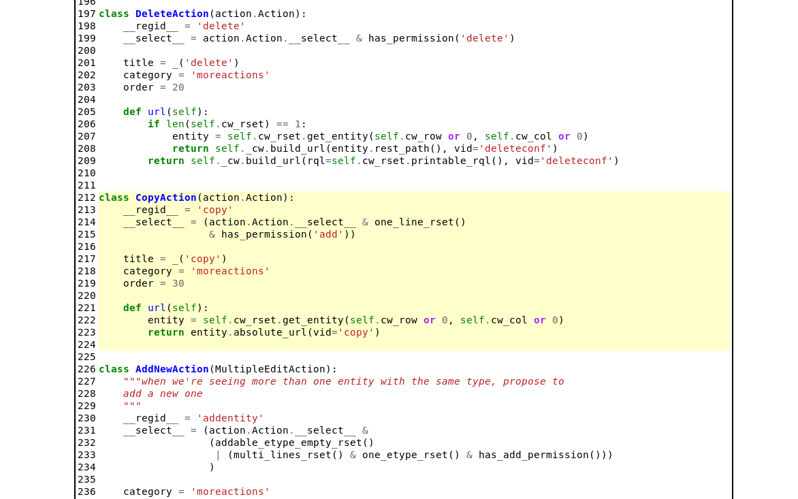

.. _debug-toolbar_pyramid:

The pyramid debug toolbar
=========================

The pyramid webserver comes with an integrated `debug toolbar
<https://docs.pylonsproject.org/projects/pyramid_debugtoolbar/>`_ that offers a
lot of information to ease development. To ease the development process in
CubicWeb a series of custom debug panels have been developped especially for
that purpose.

To use the pyramid debug toolbar in CubicWeb, you need to:

* install it either by doing a `pip install pyramid_debugtoolbar` or following
  `the official installation instructions
  <https://docs.pylonsproject.org/projects/pyramid_debugtoolbar/#installation>`_
* launch the pyramid command adding the `-t/--toolbar` argument to enable it
  like so: `cubicweb-ctl pyramid my_instance -t` (you probably want to add `-D`
  to activate the debug mode during development)
* navigate to the website and click on the icon on the right like on this screenshot:

.. image:: ../../images/debug_toolbar_icon.png

And you'll have access to the debug toolbar content for this page.

Custom panels
-------------

A series of custom debug panels have been written to offer more useful debug
information during development. Here is the list:

General 'CubicWeb' Panel
~~~~~~~~~~~~~~~~~~~~~~~~

Provides:

* currently selected controller for this with and uri/requests information
* current instance configuration, options that differs from default ones are in bold
* a list of useful links like on the default CW home

Screenshot:

Registry Decisions Panel
~~~~~~~~~~~~~~~~~~~~~~~~

Provides:

* a list of all decisions taken in all registry during this page construction
* the arguments given to take the decision
* all the selection entities during decisions with their score
* which one has won if any

Registry Store
~~~~~~~~~~~~~~

Provides:

* a listing of all the content of the different registries
* for each entity its detailed information

RQL
~~~

Provides:

* a list of all executed RQL queries during this page creation
* for each RQL query all the generated SQL queries
* detail information like the result, the args and the description of each query
* the call stack on each query to see where it has been called

SQL
~~~

Provides:

* a list of all executed SQL queries during this page creation
* for each SQL query the RQL query that has generated it, if any (some aren't)
* detail information like the result, the args and if the query has rollback
* the call stack on each query to see where it has been called

Accessing the sources of the class/functions/method listing the debug panels
----------------------------------------------------------------------------

A traversal of all those custom panels is the see the source code of all
listing class/functions/methods. You can access those by:

* clicking on the `[source]` close to the target when available
* clicking on the file path in the traceback stack

.. image:: ../../images/debugtoolbar_traceback_source_link.png

You be sent to a page looking like this:

Contributing
------------

All source code for the custom panels is located `here
<https://hg.logilab.org/master/cubicweb/file/tip/cubicweb/pyramid/debugtoolbar_panels.py>`_
and the documentation of how to write `custom toolbar panels here
<https://docs.pylonsproject.org/projects/pyramid_debugtoolbar/en/latest/#adding-custom-panels>`_.
