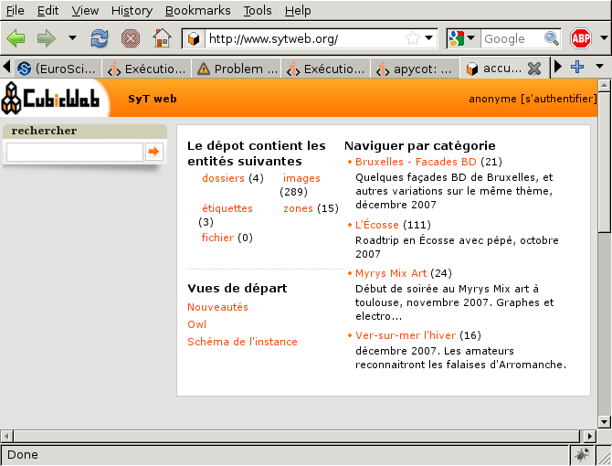
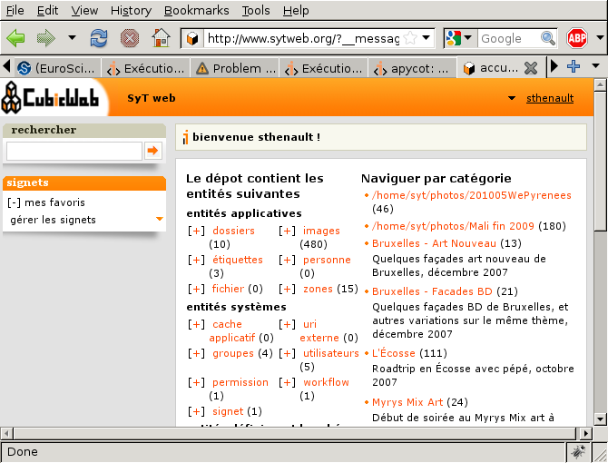
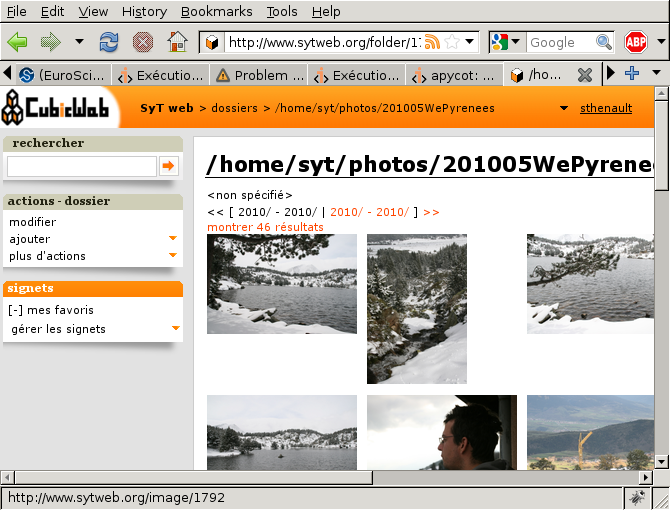

Storing images on the file-system
---------------------------------

Step 1: configuring the BytesFileSystem storage
~~~~~~~~~~~~~~~~~~~~~~~~~~~~~~~~~~~~~~~~~~~~~~~

To avoid cluttering my database, and to ease file manipulation, I don't want them
to be stored in the database. I want to be able create File entities for some
files on the server file system, where those file will be accessed to get
entities data. To do so I've to set a custom :class:`BytesFileSystemStorage`
storage for the File 'data' attribute, which hold the actual file's content.

Since the function to register a custom storage needs to have a repository
instance as first argument, we've to call it in a server startup hook. So I added
in :file:`cubicweb_sytweb/hooks.py` :

.. sourcecode:: python

    from os import makedirs
    from os.path import join, exists

    from cubicweb.server import hook
    from cubicweb.server.sources import storages

    class ServerStartupHook(hook.Hook):
        __regid__ = 'sytweb.serverstartup'
        events = ('server_startup', 'server_maintenance')

        def __call__(self):
            bfssdir = join(self.repo.config.appdatahome, 'bfss')
            if not exists(bfssdir):
                makedirs(bfssdir)
                print 'created', bfssdir
            storage = storages.BytesFileSystemStorage(bfssdir)
            storages.set_attribute_storage(self.repo, 'File', 'data', storage)

.. Note::

  * how we built the hook's registry identifier (`__regid__`): you can introduce
    'namespaces' by using there python module like naming identifiers. This is
    especially important for hooks where you usually want a new custom hook, not
    overriding / specializing an existant one, but the concept may be applied to
    any application objects

  * we catch two events here: "server_startup" and "server_maintenance". The first
    is called on regular repository startup (eg, as a server), the other for
    maintenance task such as shell or upgrade. In both cases, we need to have
    the storage set, else we'll be in trouble...

  * the path given to the storage is the place where file added through the ui
    (or in the database before migration) will be located

  * beware that by doing this, you can't anymore write queries that will try to
    restrict on File `data` attribute. Hopefuly we don't do that usually
    on file's content or more generally on attributes for the Bytes type

Now, if you've already added some photos through the web ui, you'll have to
migrate existing data so file's content will be stored on the file-system instead
of the database. There is a migration command to do so, let's run it in the
cubicweb shell (in real life, you would have to put it in a migration script as we
have seen last time):

::

   $ cubicweb-ctl shell sytweb_instance
   entering the migration python shell
   just type migration commands or arbitrary python code and type ENTER to execute it
   type "exit" or Ctrl-D to quit the shell and resume operation
   >>> storage_changed('File', 'data')
   [========================]

That's it. Now, files added through the web ui will have their content stored on
the file-system, and you'll also be able to import files from the file-system as
explained in the next part.

Step 2: importing some data into the instance
~~~~~~~~~~~~~~~~~~~~~~~~~~~~~~~~~~~~~~~~~~~~~

Hey, we start to have some nice features, let us give a try to this new web
site. For instance if I have a 'photos/201005WePyrenees' containing pictures for
a particular event, I can import it to my web site by typing ::

  $ cubicweb-ctl fsimport -F sytweb_instance photos/201005WePyrenees/
  ** importing directory /home/syt/photos/201005WePyrenees
  importing IMG_8314.JPG
  importing IMG_8274.JPG
  importing IMG_8286.JPG
  importing IMG_8308.JPG
  importing IMG_8304.JPG

.. Note::
  The -F option means that folders should be mapped, hence my photos will be
  linked to a Folder entity corresponding to the file-system folder.

Let's take a look at the web ui:

Nothing different, I can't see the new folder... But remember our security model!
By default, files are only accessible to authenticated users, and I'm looking at
the site as anonymous, e.g. not authenticated. If I login, I can now see:

Yeah, it's there! You will notice that I can see some entities as well as
folders and images the anonymous user can't. It just works **everywhere in the
ui** since it's handled at the repository level, thanks to our security model.

Now if I click on the recently inserted folder, I can see

Great! There is even my pictures in the folder. I can know give to this folder a
nicer name (provided I don't intend to import from it anymore, else already
imported photos will be reimported), change permissions, title for some pictures,
etc... Having a good content is much more difficult than having a good web site
;)

Conclusion
~~~~~~~~~~

We started to see here an advanced feature of our repository: the ability
to store some parts of our data-model into a custom storage, outside the
database. There is currently only the :class:`BytesFileSystemStorage` available,
but you can expect to see more coming in a near future (or write your own!).

Also, we can know start to feed our web-site with some nice pictures!
The site isn't perfect (far from it actually) but it's usable, and we can
now start using it and improve it on the way. The Incremental Cubic Way :)
