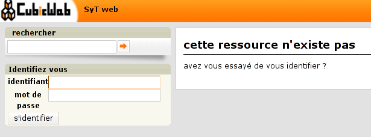
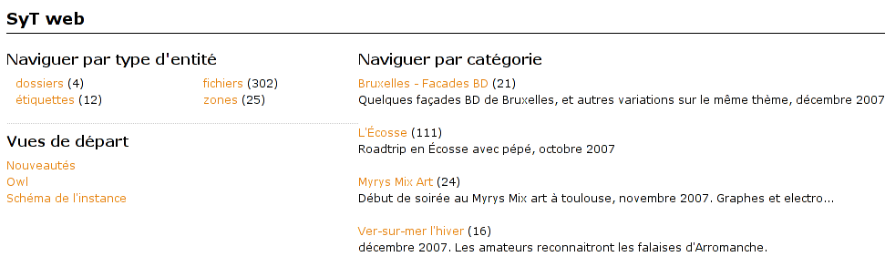
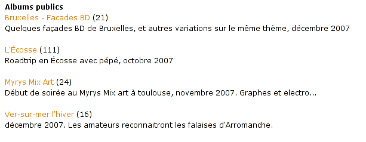
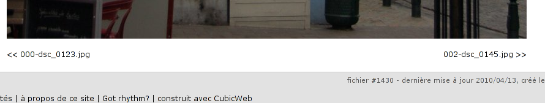
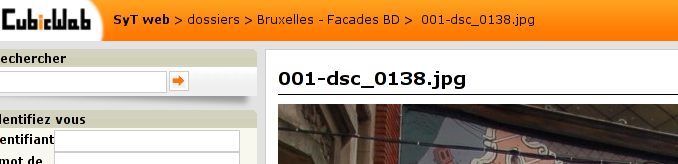

Let's make it more user friendly
================================

Step 1: let's improve site's usability for our visitors
~~~~~~~~~~~~~~~~~~~~~~~~~~~~~~~~~~~~~~~~~~~~~~~~~~~~~~~

The first thing I've noticed is that people to whom I send links to photos with
some login/password authentication get lost, because they don't grasp they have
to login by clicking on the 'authenticate' link. That's much probably because
they only get a 404 when trying to access an unauthorized folder, and the site
doesn't make clear that 1. you're not authenticated, 2. you could get more
content by authenticating yourself.

So, to improve this situation, I decided that I should:

* make a login box appears for anonymous, so they see at a first glance a place
  to put the login / password information I provided

* customize the 404 page, proposing to login to anonymous.

Here is the code, samples from my cube's :file:`views.py` file:

.. sourcecode:: python

    from cubicweb import _
    from cubicweb.web import component
    from cubicweb.web.views import error
    from cubicweb.predicates import anonymous_user

    class FourOhFour(error.FourOhFour):
        __select__ = error.FourOhFour.__select__ & anonymous_user()

        def call(self):
            self.w(u"<h1>%s</h1>" % self._cw._('this resource does not exist'))
            self.w(u"
%s
" % self._cw._('have you tried to login?'))

    class LoginBox(component.CtxComponent):
        """display a box containing links to all startup views"""
        __regid__ = 'sytweb.loginbox'
        __select__ = component.CtxComponent.__select__ & anonymous_user()

        title = _('Authenticate yourself')
        order = 70

        def render_body(self, w):
            cw = self._cw
            form = cw.vreg['forms'].select('logform', cw)
            form.render(w=w, table_class='', display_progress_div=False)

The first class provides a new specific implementation of the default page you
get on 404 error, to display an adapted message to anonymous user.

.. Note::

  Thanks to the selection mecanism, it will be selected for anoymous user,
  since the additional `anonymous_user()` selector gives it a higher score than
  the default, and not for authenticated since this selector will return 0 in
  such case (hence the object won't be selectable)

The second class defines a simple box, that will be displayed by default with
boxes in the left column, thanks to default :class:`component.CtxComponent`
selector. The HTML is written to match default CubicWeb boxes style. The code
fetch the actual login form and render it.

   The login box and the custom 404 page for an anonymous visitor (translated in french)

Step 2: providing a custom index page
~~~~~~~~~~~~~~~~~~~~~~~~~~~~~~~~~~~~~

Another thing we can easily do to improve the site is... A nicer index page
(e.g. the first page you get when accessing the web site)! The default one is
quite intimidating (that should change in a near future). I will provide a much
simpler index page that simply list available folders (e.g. photo albums in that
site).

Here is the code, samples from my cube's :file:`views.py` file:

.. sourcecode:: python

    from cubicweb.web.views import startup

    class IndexView(startup.IndexView):
        def call(self, **kwargs):
            self.w(u'
\n')
            if self._cw.cnx.session.anonymous_session:
                self.w(u'<h4>%s</h4>\n' % self._cw._('Public Albums'))
            else:
                self.w(u'<h4>%s</h4>\n' % self._cw._('Albums for %s') % self._cw.user.login)
            self._cw.vreg['views'].select('tree', self._cw).render(w=self.w)
            self.w(u'
\n')

    def registration_callback(vreg):
        vreg.register_all(globals().values(), __name__, (IndexView,))
        vreg.register_and_replace(IndexView, startup.IndexView)

As you can see, we override the default index view found in
`cubicweb.web.views.startup`, getting back nothing but its identifier and selector
since we override the top level view's `call` method.

.. Note::

  in that case, we want our index view to **replace** the existing one. To do so
  we've to implements the `registration_callback` function, in which we tell to
  register everything in the module *but* our IndexView, then we register it
  instead of the former index view.

Also, we added a title that tries to make it more evident that the visitor is
authenticated, or not. Hopefully people will get it now!

   The default index page

   Our simpler, less intimidating, index page (still translated in french)

Step 3: more navigation improvements
~~~~~~~~~~~~~~~~~~~~~~~~~~~~~~~~~~~~

There are still a few problems I want to solve...

* Images in a folder are displayed in a somewhat random order. I would like to
  have them ordered by file's name (which will usually, inside a given folder,
  also result ordering photo by their date and time)

* When clicking a photo from an album view, you've to get back to the gallery
  view to go to the next photo. This is pretty annoying...

* Also, when viewing an image, there is no clue about the folder to which this
  image belongs to.

I will first try to explain the ordering problem. By default, when accessing
related entities by using the ORM's API, you should get them ordered according to
the target's class `cw_fetch_order`. If we take a look at the file cube'schema,
we can see:

.. sourcecode:: python

    class File(AnyEntity):
        """customized class for File entities"""
        __regid__ = 'File'
        fetch_attrs, cw_fetch_order = fetch_config(['data_name', 'title'])

By default, `fetch_config` will return a `cw_fetch_order` method that will order
on the first attribute in the list. So, we could expect to get files ordered by
their name. But we don't. What's up doc?

The problem is that files are related to folder using the `filed_under` relation.
And that relation is ambiguous, eg it can lead to `File` entities, but also to
`Folder` entities. In such case, since both entity types doesn't share the
attribute on which we want to sort, we'll get linked entities sorted on a common
attribute (usually `modification_date`).

To fix this, we've to help the ORM. We'll do this in the method from the `ITree`
folder's adapter, used in the folder's primary view to display the folder's
content. Here's the code, that I've put in our cube's :file:`entities.py` file, since
it's more logical stuff than view stuff:

.. sourcecode:: python

    from cubes.folder import entities as folder

    class FolderITreeAdapter(folder.FolderITreeAdapter):

        def different_type_children(self, entities=True):
            rql = self.entity.cw_related_rql(self.tree_relation,
                                             self.parent_role, ('File',))
            rset = self._cw.execute(rql, {'x': self.entity.eid})

            if entities:
                return list(rset.entities())

            return rset

    def registration_callback(vreg):
        vreg.register_and_replace(FolderITreeAdapter, folder.FolderITreeAdapter)

As you can see, we simple inherit from the adapter defined in the `folder` cube,
then we override the `different_type_children` method to give a clue to the ORM's
`cw_related_rql` method, that is responsible to generate the rql to get entities
related to the folder by the `filed_under` relation (the value of the
`tree_relation` attribute).  The clue is that we only want to consider the `File`
target entity type. By doing this, we remove the ambiguity and get back a RQL
query that correctly order files by their `data_name` attribute.

.. Note::

    * As seen earlier, we want to **replace** the folder's `ITree` adapter by our
      implementation, hence the custom `registration_callback` method.

Ouf. That one was tricky...

Now the easier parts. Let's start by adding some links on the file's primary view
to see the previous / next image in the same folder. CubicWeb's provide a
component that do exactly that. To make it appears, one have to be adaptable to
the `IPrevNext` interface. Here is the related code sample, extracted from our
cube's :file:`views.py` file:

.. sourcecode:: python

    from cubicweb.predicates import is_instance
    from cubicweb.web.views import navigation

    class FileIPrevNextAdapter(navigation.IPrevNextAdapter):
        __select__ = is_instance('File')

        def previous_entity(self):
            rset = self._cw.execute('File F ORDERBY FDN DESC LIMIT 1 WHERE '
                                    'X filed_under FOLDER, F filed_under FOLDER, '
                                    'F data_name FDN, X data_name > FDN, X eid %(x)s',
                                    {'x': self.entity.eid})
            if rset:
                return rset.get_entity(0, 0)

        def next_entity(self):
            rset = self._cw.execute('File F ORDERBY FDN ASC LIMIT 1 WHERE '
                                    'X filed_under FOLDER, F filed_under FOLDER, '
                                    'F data_name FDN, X data_name < FDN, X eid %(x)s',
                                    {'x': self.entity.eid})
            if rset:
                return rset.get_entity(0, 0)

The `IPrevNext` interface implemented by the adapter simply consist in the
`previous_entity` / `next_entity` methods, that should respectivly return the
previous / next entity or `None`. We make an RQL query to get files in the same
folder, ordered similarly (eg by their `data_name` attribute). We set
ascendant/descendant ordering and a strict comparison with current file's name
(the "X" variable representing the current file).

Notice that this query supposes we wont have two files of the same name in the
same folder, else things may go wrong. Fixing this is out of the scope of this
tutorial. And as I would like to have at some point a smarter, context sensitive
previous/next entity, I'll probably never fix this query (though if I had to, I
would probably choosing to add a constraint in the schema so that we can't add
two files of the same name in a folder).

One more thing: by default, the component will be displayed below the content
zone (the one with the white background). You can change this in the site's
properties through the ui, but you can also change the default value in the code
by modifying the `context` attribute of the component:

.. sourcecode:: python

    navigation.NextPrevNavigationComponent.context = 'navcontentbottom'

.. Note::

   `context` may be one of 'navtop', 'navbottom', 'navcontenttop' or
   'navcontentbottom'; the first two being outside the main content zone, the two
   others inside it.

   The previous/next entity component, at the bottom of the main content zone.

Now, the only remaining stuff in my todo list is to see the file's folder. I'll use
the standard breadcrumb component to do so. Similarly as what we've seen before, this
component is controled by the :class:`IBreadCrumbs` interface, so we'll have to provide a custom
adapter for `File` entity, telling the a file's parent entity is its folder:

.. sourcecode:: python

    from cubicweb.web.views import ibreadcrumbs

    class FileIBreadCrumbsAdapter(ibreadcrumbs.IBreadCrumbsAdapter):
        __select__ = is_instance('File')

        def parent_entity(self):
            if self.entity.filed_under:
                return self.entity.filed_under[0]

In that case, we simply use attribute notation provided by the ORM to get the
folder in which the current file (e.g. `self.entity`) is located.

.. Note::

   The :class:`IBreadCrumbs` interface is a `breadcrumbs` method, but the default
   :class:`IBreadCrumbsAdapter` provides a default implementation for it that will look
   at the value returned by its `parent_entity` method. It also provides a
   default implementation for this method for entities adapting to the `ITree`
   interface, but as our `File` doesn't, we've to provide a custom adapter.

   The breadcrumb component when on a file entity, now displaying parent folder.

Step 4: preparing the release and migrating the instance
~~~~~~~~~~~~~~~~~~~~~~~~~~~~~~~~~~~~~~~~~~~~~~~~~~~~~~~~
Now that greatly enhanced our cube, it's time to release it to upgrade production site.
I'll probably detail that process later, but I currently simply transfer the new code
to the server running the web site.

However, I've still today some step to respect to get things done properly...

First, as I've added some translatable string, I've to run: ::

  $ cubicweb-ctl i18ncube sytweb

To update the cube's gettext catalogs (the '.po' files under the cube's `i18n`
directory). Once the above command is executed, I'll then update translations.

To see if everything is ok on my test instance, I do: ::

  $ cubicweb-ctl i18ninstance sytweb_instance
  $ cubicweb-ctl start -D sytweb_instance

The first command compile i18n catalogs (e.g. generates '.mo' files) for my test
instance. The second command start it in debug mode, so I can open my browser and
navigate through the web site to see if everything is ok...

.. Note::

   In the 'cubicweb-ctl i18ncube' command, `sytweb` refers to the **cube**, while
   in the two other, it refers to the **instance** (if you can't see the
   difference, reread `CubicWeb's concept chapter <../../intro/concepts/>`_!).

Once I've checked it's ok, I simply have to bump the version number in the
:file:`__pkginfo__` module to trigger a migration once I'll have updated the code on
the production site. I can check then check the migration is also going fine, by
first restoring a dump from the production site, then upgrading my test instance.

To generate a dump from the production site: ::

  $ cubicweb-ctl db-dump sytweb_instance
  # if it's postgresql
  pg_dump -Fc --username=syt --no-owner --file /home/syt/etc/cubicweb.d/sytweb/backup/tmpYIN0YI/system sytweb
  # if it's sqlite
  gzip -c /home/psycojoker/etc/cubicweb.d/sytweb_instance/sytweb_instance.sqlite
  -> backup file /home/syt/etc/cubicweb.d/sytweb/backup/sytweb-2010-07-13_10-22-40.tar.gz

I can now get back the dump file (:file:`sytweb-2010-07-13_10-22-40.tar.gz`) to my test
machine (using `scp` for instance) to restore it and start migration: ::

  $ cubicweb-ctl db-restore sytweb_instance /path/path/to/sytweb-2010-07-13_10-22-40.tar.gz
  $ cubicweb-ctl upgrade sytweb_instance

You might have to answer some questions, as we've seen in `a previous part`_.

Now that everything is tested, I can transfer the new code to the production
server, `pip install` CubicWeb and its dependencies, and eventually
upgrade the production instance.

.. _`several improvments`: http://www.cubicweb.org/blogentry/1179899
.. _`3.8`: http://www.cubicweb.org/blogentry/917107
.. _`first blog of this series`: http://www.cubicweb.org/blogentry/824642
.. _`a previous part`: TutosPhotoWebSiteSecurity
