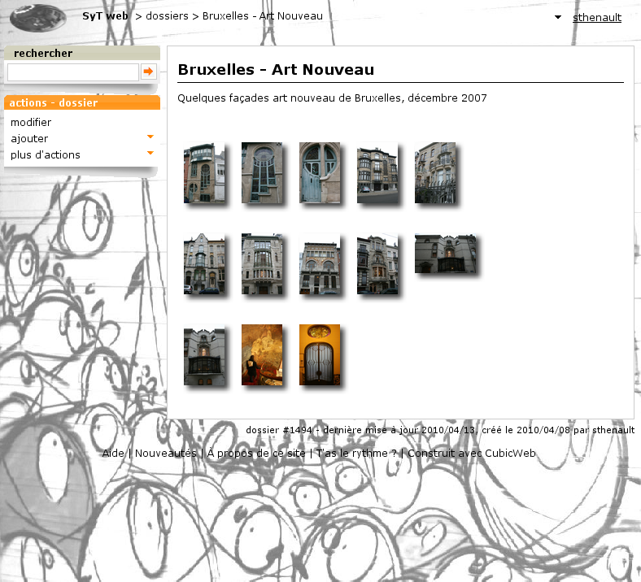
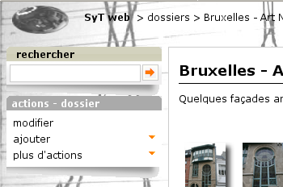
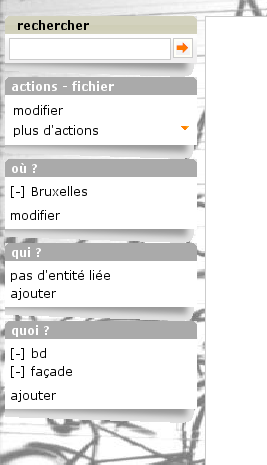
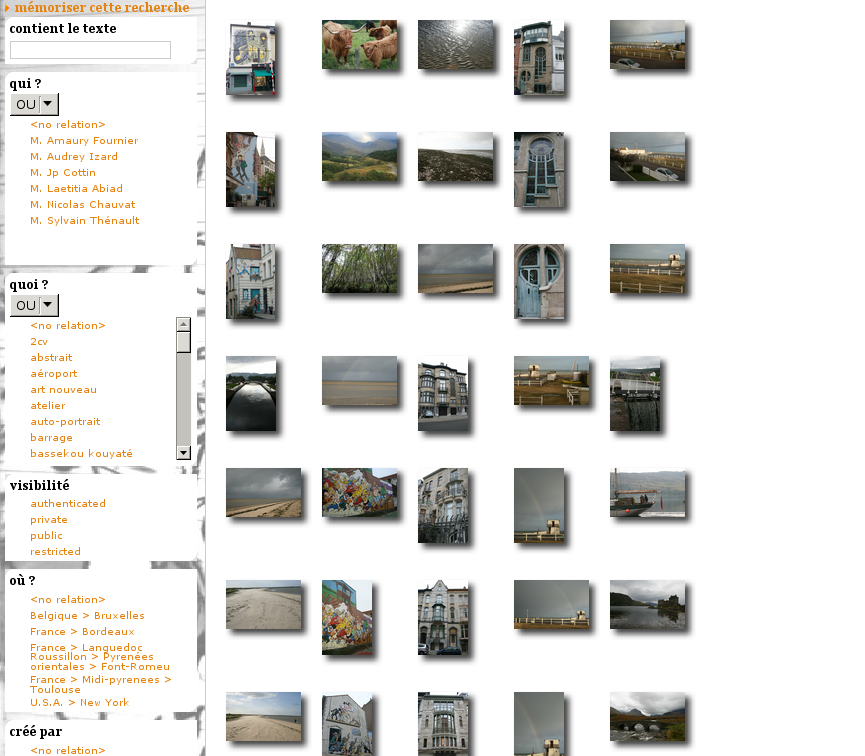

Building my photos web site with |cubicweb| part V: let's make it even more user friendly
=========================================================================================

.. _uiprops:

Step 1: tired of the default look?
~~~~~~~~~~~~~~~~~~~~~~~~~~~~~~~~~~

OK... Now our site has its most desired features. But... I would like to make it look
somewhat like *my* website. It is not www.cubicweb.org after all. Let's tackle this
first!

The first thing we can to is to change the logo. There are various way to achieve
this. The easiest way is to put a :file:`logo.png` file into the cube's :file:`data`
directory. As data files are looked at according to cubes order (CubicWeb
resources coming last), that file will be selected instead of CubicWeb's one.

.. Note::
   As the location for static resources are cached, you'll have to restart
   your instance for this to be taken into account.

Though there are some cases where you don't want to use a :file:`logo.png` file.
For instance if it's a JPEG file. You can still change the logo by defining in
the cube's :file:`uiprops.py` file:

.. sourcecode:: python

   LOGO = data('logo.jpg')

.. Note::
   If the file :file:`uiprops.py` doesn't exist in your cube, simply create it.

The uiprops machinery is used to define some static file resources,
such as the logo, default Javascript / CSS files, as well as CSS
properties (we'll see that later).

.. Note::
   This file is imported specifically by |cubicweb|, with a predefined name space,
   containing for instance the `data` function, telling the file is somewhere
   in a cube or CubicWeb's data directory.

   One side effect of this is that it can't be imported as a regular python
   module.

The nice thing is that in debug mode, change to a :file:`uiprops.py` file are detected
and then automatically reloaded.

Now, as it's a photos web-site, I would like to have a photo of mine as background...
After some trials I won't detail here, I've found a working recipe explained `here`_.
All I've to do is to override some stuff of the default CubicWeb user interface to
apply it as explained.

The first thing to to get the ```` tag as first element after the
``<body>`` tag.  If you know a way to avoid this by simply specifying the image
in the CSS, tell me!  The easiest way to do so is to override the
:class:`HTMLPageHeader` view, since that's the one that is directly called once
the ``<body>`` has been written. How did I find this?  By looking in the
:mod:`cubiweb.web.views.basetemplates` module, since I know that global page
layouts sits there. I could also have grep the "body" tag in
:mod:`cubicweb.web.views`... Finding this was the hardest part. Now all I need is
to customize it to write that ``img`` tag, as below in :file:`views.py`:

.. sourcecode:: python

    from cubicweb.web.views import basetemplates


    class HTMLPageHeader(basetemplates.HTMLPageHeader):
        # override this since it's the easier way to have our bg image
        # as the first element following <body>
        def call(self, **kwargs):
            self.w(u''
                   % self._cw.datadir_url)
            super(HTMLPageHeader, self).call(**kwargs)


    def registration_callback(vreg):
        vreg.register_all(globals().values(), __name__, (HTMLPageHeader))
        vreg.register_and_replace(HTMLPageHeader, basetemplates.HTMLPageHeader)


As you may have guessed, my background image is in a :file:`background.jpg` file
in the cube's :file:`data` directory, but there are still some things to explain
to newcomers here:

* The :meth:`call` method is there the main access point of the view. It's called by
  the view's :meth:`render` method. It is not the only access point for a view, but
  this will be detailed later.

* Calling `self.w` writes something to the output stream. Except for binary views
  (which do not generate text), it *must* be passed an Unicode string.

* The proper way to get a file in :file:`data` directory is to use the `datadir_url`
  attribute of the incoming request (e.g. `self._cw`).

I won't explain again the :func:`registration_callback` stuff, you should understand it
now!  If not, go back to `previous post in the series`_ :)

Fine. Now all I've to do is to add a bit of CSS to get it to behave nicely (which
is not the case at all for now). I'll put all this in a :file:`cubes.sytweb.css`
file, stored as usual in our :file:`data` directory:

.. sourcecode:: css


    /* fixed full screen background image
     * as explained on http://webdesign.about.com/od/css3/f/blfaqbgsize.htm
     *
     * syt update: set z-index=0 on the img instead of z-index=1 on div#page & co to
     * avoid pb with the user actions menu
     */
    img#bg-image {
        position: fixed;
        top: 0;
        left: 0;
        width: 100%;
        height: 100%;
        z-index: 0;
    }

    div#page, table#header, div#footer {
        background: transparent;
        position: relative;
    }

    /* add some space around the logo
     */
    img#logo {
        padding: 5px 15px 0px 15px;
    }

    /* more dark font for metadata to have a chance to see them with the background
     *  image
     */
    div.metadata {
        color: black;
    }

You can see here stuff explained in the cited page, with only a slight modification
explained in the comments, plus some additional rules to make things somewhat cleaner:

* a bit of padding around the logo

* darker metadata which appears by default below the content (the white frame in the page)

To get this CSS file used everywhere in the site, I have to modify the :file:`uiprops.py` file
introduced above:

.. sourcecode:: python

   STYLESHEETS = sheet['STYLESHEETS'] + [data('cubes.sytweb.css')]

.. Note::
   `sheet` is another predefined variable containing values defined by
   already process `:file:`uiprops.py`` file, notably the CubicWeb's one.

Here we simply want our CSS in addition to CubicWeb's base CSS files, so we
redefine the `STYLESHEETS` variable to existing CSS (accessed through the `sheet`
variable) with our one added. I could also have done:

.. sourcecode:: python

   sheet['STYLESHEETS'].append(data('cubes.sytweb.css'))

But this is less interesting since we don't see the overriding mechanism...

At this point, the site should start looking good, the background image being
resized to fit the screen.



The final touch: let's customize CubicWeb's CSS to get less orange... By simply adding

.. sourcecode:: python

  contextualBoxTitleBg = incontextBoxTitleBg = '#AAAAAA'

and reloading the page we've just seen, we know have a nice greyed box instead of
the orange one:



This is because CubicWeb's CSS include some variables which are
expanded by values defined in :file:`uiprops.py` file. In our case we controlled the
properties of the CSS `background` property of boxes with CSS class
`contextualBoxTitleBg` and `incontextBoxTitleBg`.


Step 2: configuring boxes
~~~~~~~~~~~~~~~~~~~~~~~~~

Boxes present to the user some ways to use the application. Let's first do a few
user interface tweaks in our :file:`views.py` file:

.. sourcecode:: python

  from cubicweb.predicates import none_rset
  from cubicweb.web.views import bookmark
  from cubicweb_zone import views as zone
  from cubicweb_tag import views as tag


  # change bookmarks box selector so it's only displayed on startup views
  bookmark.BookmarksBox.__select__ = bookmark.BookmarksBox.__select__ & none_rset()
  # move zone box to the left instead of in the context frame and tweak its order
  zone.ZoneBox.context = 'left'
  zone.ZoneBox.order = 100
  # move tags box to the left instead of in the context frame and tweak its order
  tag.TagsBox.context = 'left'
  tag.TagsBox.order = 102
  # hide similarity box, not interested
  tag.SimilarityBox.visible = False

The idea is to move all boxes in the left column, so we get more space for the
photos.  Now, serious things: I want a box similar to the tags box but to handle
the `Person displayed_on File` relation. We can do this simply by adding a
:class:`AjaxEditRelationCtxComponent` subclass to our views, as below:

.. sourcecode:: python

    from cubicweb import _
    from logilab.common.decorators import monkeypatch
    from cubicweb import ValidationError
    from cubicweb.web.views import uicfg, component
    from cubicweb.web.views import basecontrollers


    # hide displayed_on relation using uicfg since it will be displayed by the box below
    uicfg.primaryview_section.tag_object_of(('*', 'displayed_on', '*'), 'hidden')


    class PersonBox(component.AjaxEditRelationCtxComponent):
        __regid__ = 'sytweb.displayed-on-box'
        # box position
        order = 101
        context = 'left'
        # define relation to be handled
        rtype = 'displayed_on'
        role = 'object'
        target_etype = 'Person'
        # messages
        added_msg = _('person has been added')
        removed_msg = _('person has been removed')
        # bind to js_* methods of the json controller
        fname_vocabulary = 'unrelated_persons'
        fname_validate = 'link_to_person'
        fname_remove = 'unlink_person'


    @monkeypatch(basecontrollers.JSonController)
    @basecontrollers.jsonize
    def js_unrelated_persons(self, eid):
        """return tag unrelated to an entity"""
        rql = "Any F + ' ' + S WHERE P surname S, P firstname F, X eid %(x)s, NOT P displayed_on X"
        return [name for (name,) in self._cw.execute(rql, {'x' : eid})]


    @monkeypatch(basecontrollers.JSonController)
    def js_link_to_person(self, eid, people):
        req = self._cw
        for name in people:
            name = name.strip().title()
            if not name:
                continue
            try:
                firstname, surname = name.split(None, 1)
            except:
                raise ValidationError(eid, {('displayed_on', 'object'): 'provide <first name> <surname>'})
            rset = req.execute('Person P WHERE '
                               'P firstname %(firstname)s, P surname %(surname)s',
                               locals())
            if rset:
                person = rset.get_entity(0, 0)
            else:
                person = req.create_entity('Person', firstname=firstname,
                                                surname=surname)
            req.execute('SET P displayed_on X WHERE '
                        'P eid %(p)s, X eid %(x)s, NOT P displayed_on X',
                        {'p': person.eid, 'x' : eid})


    @monkeypatch(basecontrollers.JSonController)
    def js_unlink_person(self, eid, personeid):
        self._cw.execute('DELETE P displayed_on X WHERE P eid %(p)s, X eid %(x)s',
                         {'p': personeid, 'x': eid})


You basically subclass to configure with some class attributes. The `fname_*`
attributes give the name of methods that should be defined on the json control to
make the AJAX part of the widget work: one to get the vocabulary, one to add a
relation and another to delete a relation. These methods must start by a `js_`
prefix and are added to the controller using the `@monkeypatch` decorator. In my
case, the most complicated method is the one which adds a relation, since it
tries to see if the person already exists, and else automatically create it,
assuming the user entered "firstname surname".

Let's see how it looks like on a file primary view:



Great, it's now as easy for me to link my pictures to people than to tag them.
Also, visitors get a consistent display of these two pieces of information.

.. Note::
  The ui component system has been refactored in `CubicWeb 3.10`_, which also
  introduced the :class:`AjaxEditRelationCtxComponent` class.


Step 3: configuring facets
~~~~~~~~~~~~~~~~~~~~~~~~~~

The last feature we'll add today is facet configuration. If you access to the
'/file' url, you'll see a set of 'facets' appearing in the left column. Facets
provide an intuitive way to build a query incrementally, by proposing to the user
various way to restrict the result set. For instance CubicWeb proposes a facet to
restrict based on who created an entity; the tag cube proposes a facet to
restrict based on tags; the zoe cube a facet to restrict based on geographical
location, and so on. In that gist, I want to propose a facet to restrict based on
the people displayed on the picture. To do so, there are various classes in the
:mod:`cubicweb.web.facet` module which simply have to be configured using class
attributes as we've done for the box. In our case, we'll define a subclass of
:class:`RelationFacet`.

.. Note::

   Since that's ui stuff, we'll continue to add code below to our
   :file:`views.py` file. Though we begin to have a lot of various code their, so
   it's may be a good time to split our views module into submodules of a `view`
   package. In our case of a simple application (glue) cube, we could start using
   for instance the layout below: ::

     views/__init__.py   # uicfg configuration, facets
     views/layout.py     # header/footer/background stuff
     views/components.py # boxes, adapters
     views/pages.py      # index view, 404 view

.. sourcecode:: python

    from cubicweb.web import facet


    class DisplayedOnFacet(facet.RelationFacet):
        __regid__ = 'displayed_on-facet'
        # relation to be displayed
        rtype = 'displayed_on'
        role = 'object'
        # view to use to display persons
        label_vid = 'combobox'

Let's say we also want to filter according to the `visibility` attribute. This is
even simpler as we just have to derive from the :class:`AttributeFacet` class:

.. sourcecode:: python

    class VisibilityFacet(facet.AttributeFacet):
        __regid__ = 'visibility-facet'
        rtype = 'visibility'

Now if I search for some pictures on my site, I get the following facets available:



.. Note::

  By default a facet must be applyable to every entity in the result set and
  provide at leat two elements of vocabulary to be displayed (for instance you
  won't see the `created_by` facet if the same user has created all
  entities). This may explain why you don't see yours...


Conclusion
~~~~~~~~~~

We started to see the power behind the infrastructure provided by the
framework, both on the pure ui (CSS, Javascript) side and on the Python side
(high level generic classes for components, including boxes and facets). We now
have, with a few lines of code, a full-featured web site with a personalized look.

Of course we'll probably want more as time goes, but we can now
concentrate on making good pictures, publishing albums and sharing them with
friends...


.. _`CubicWeb 3.10`: http://www.cubicweb.org/blogentry/1330518
.. _`here`: http://webdesign.about.com/od/css3/f/blfaqbgsize.htm
.. _`previous post in the series`: part04_ui-base.rst
