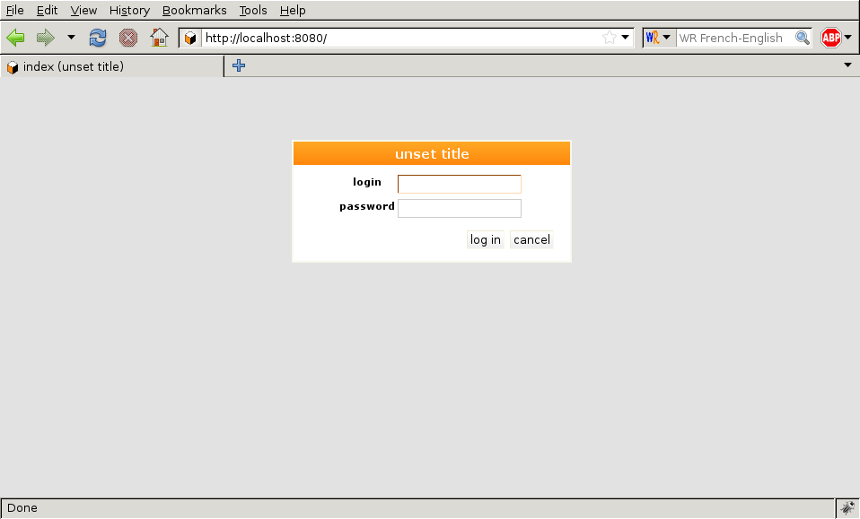
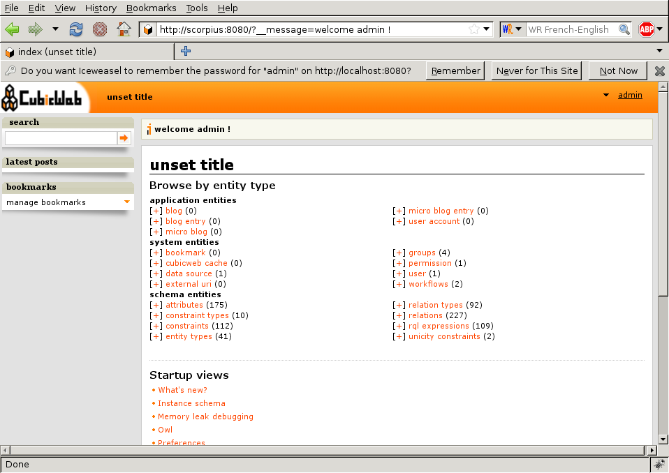
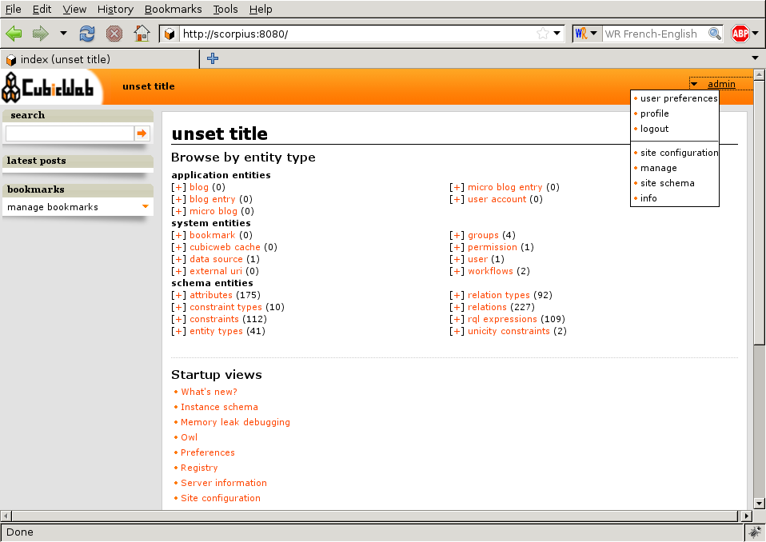
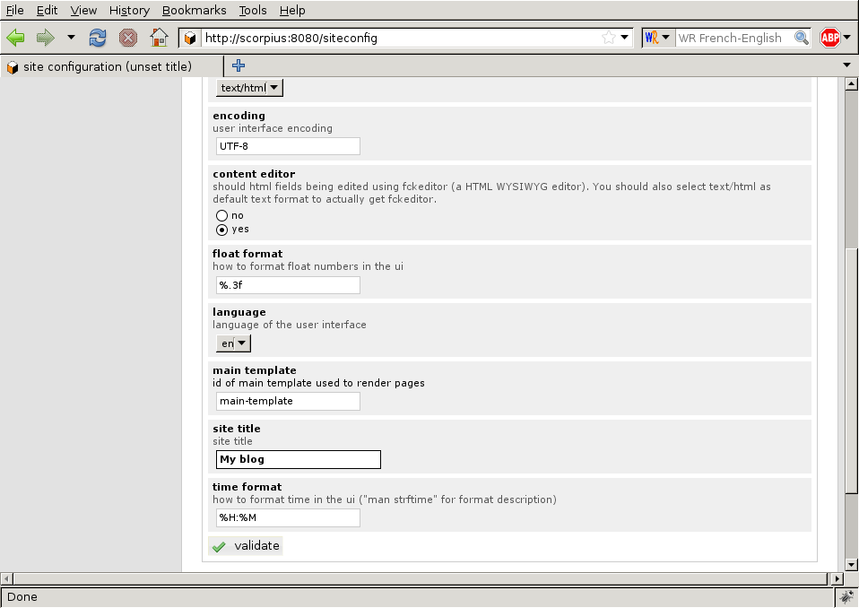
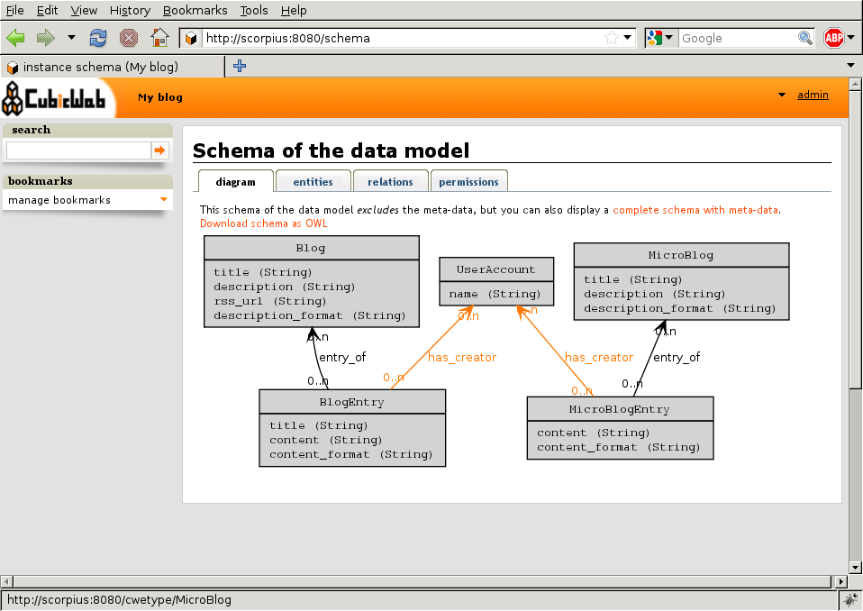
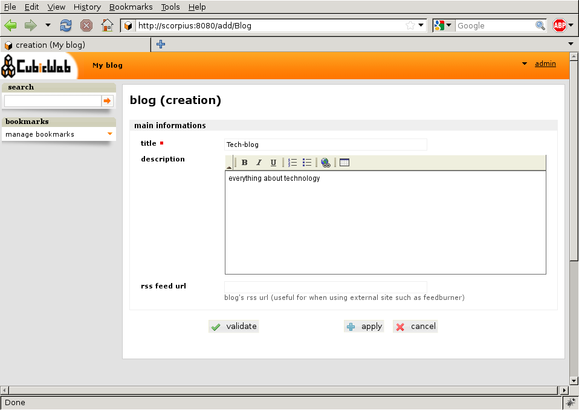
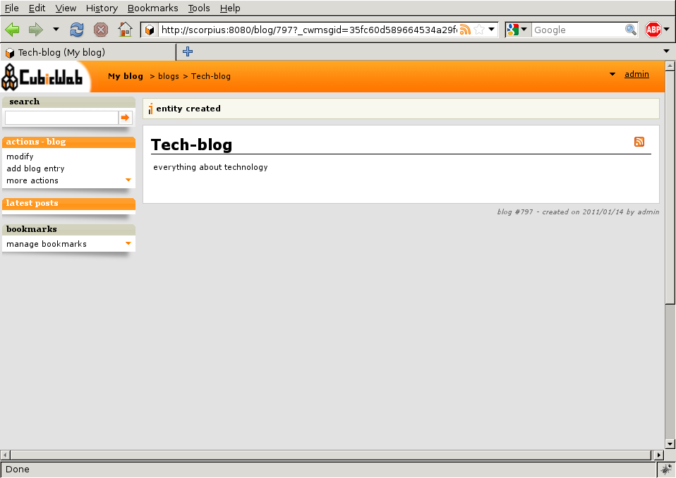
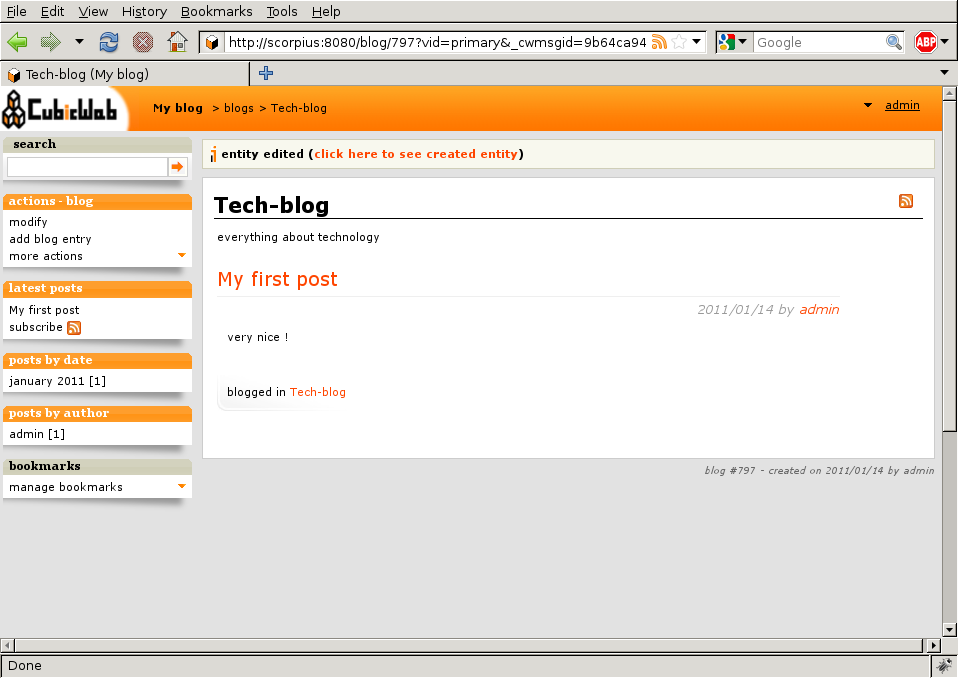
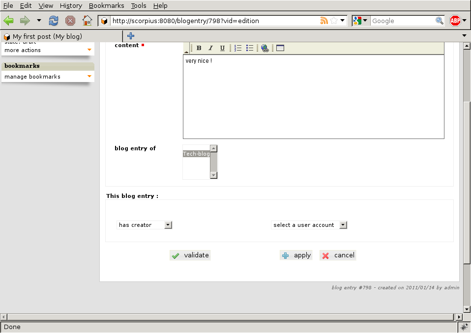
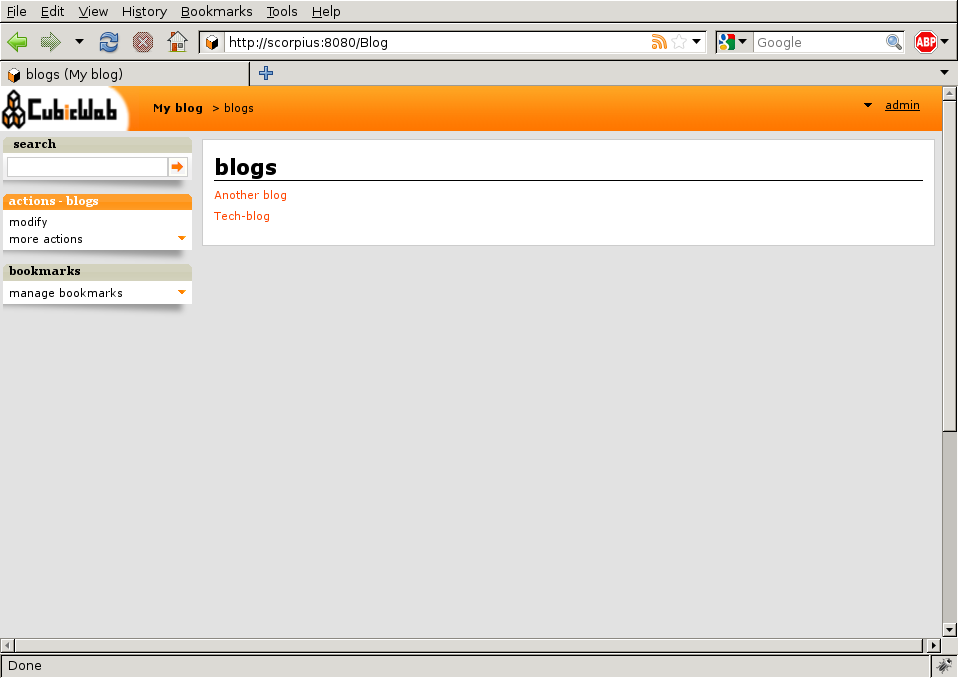

.. _TutosBaseDiscoveringTheUI:

Discovering the web interface
-----------------------------

You can now access your web instance to create blogs and post messages
by visiting the URL http://localhost:8080/.

By default, anonymous access is disabled, so a login form will appear. If you
asked to allow anonymous access when initializing the instance, click on the
'login' link in the top right hand corner. To login, you need then use the admin
account you specified at the time you initialized the database with
``cubicweb-ctl create``.

Once authenticated, you can start playing with your instance. The default index
page looks like the following:

Minimal configuration
~~~~~~~~~~~~~~~~~~~~~

Before creating entities, let's change that 'unset title' thing that appears
here and there. This comes from a |cubicweb| system properties. To set it,
click on the 'configuration link' in the pop-up menu behind your login name
in the upper left-hand corner

The site title is in the 'Ui' section. Simply set it to the desired value and
click the 'validate' button.

You should see a 'changes applied' message. You can now go back to the
index page by clicking on the |cubicweb| logo in the upper left-hand corner.

You will much likely still see 'unset title' at this point. This is because by
default the index page is cached. Force a refresh of the page (by typing Ctrl-R
in Firefox for instance) and you should now see the title you entered.

Adding entities
~~~~~~~~~~~~~~~

The ``blog`` cube defines several entity types, among them ``Blog`` which is a
container for ``BlogEntry`` (i.e. posts) on a particular topic. We can get a
graphical view of the schema by clicking on the 'site schema' link in the user
pop-up menu we've already seen:

Nice isn't it? Notice that this, as most other stuff we'll see in this tutorial,
is generated by the framework according to the model of the application. In our
case, the model defined by the ``blog`` cube.

Now let us create a few of these entities.

Add a blog
**********

Clicking on the `[+]` at the left of the 'Blog' link on the index page will lead
you to an HTML form to create a blog.

For instance, call this new blog 'Tech-blog' and type in 'everything about
technology' as the description , then validate the form by clicking on
'Validate'. You will be redirected to the `primary` view of the newly created blog.

Add a blog post
***************

There are several ways to add a blog entry. The simplest is to click on the 'add
blog entry' link in the actions box on viewing the blog you have just created.
You will then see a form to create a post, with a 'blog entry of' field preset
to the blog we're coming from. Enter a title, some content, click the 'validate'
button and you're done. You will be redirected to the blog primary view, though you
now see that it contains the blog post you've just created.

Notice there are some new boxes that appears in the left column.

You can achieve the same thing by following the same path as we did for the blog
creation, e.g. by clicking on the `[+]` at the left of the 'Blog entry' link on
the index page. The difference being that since there is no context information,
the 'blog entry of' selector won't be preset to the blog.

If you click on the 'modify' link of the action box, you are back to
the form to edit the entity you just created, except that the form now
has another section with a combo-box entitled 'add relation'. It
provides a generic way to edit relations which don't appears in the
above form. Choose the relation you want to add and a second combo box
appears where you can pick existing entities. If there are too many
of them, you will be offered to navigate to the target entity, that is
go away from the form and go back to it later, once you've selected
the entity you want to link with.

This combo box can't appear until the entity is actually created. That's why you
haven't seen it at creation time. You could also have hit 'Apply' instead of
'validate' and it would have showed up.

About ui auto-adaptation
~~~~~~~~~~~~~~~~~~~~~~~~

One of the things that make |cubicweb| different of other frameworks is
its automatic user interface that adapts itself according to the data being
displayed. Let's see an example.

If you go back to the home page an click on the 'Blog' link, you will be redirected
to the primary view of the blog, the same we've seen earlier. Now, add another
blog, go back to the index page, and click again on this link. You will see
a very different view (namely the 'list' view).

This is because in the first case, the framework chose to use the 'primary'
view since there was only one entity in the data to be displayed. Now that there
are two entities, the 'list' view is more appropriate and hence is being used.

There are various other places where |cubicweb| adapts to display data in the best
way, the main being provided by the view *selection* mechanism that will be detailed
later.

Digging deeper
~~~~~~~~~~~~~~

By following principles explained below, you should now be able to
create new users for your application, to configure with a finer
grain, etc... You will notice that the index page lists a lot of types
you don't know about. Most are built-in types provided by the framework
to make the whole system work. You may ignore them in a first time and
discover them as time goes.

One thing that is worth playing with is the search box. It may be used in various
way, from simple full text search to advanced queries using the :ref:`RQL` .
